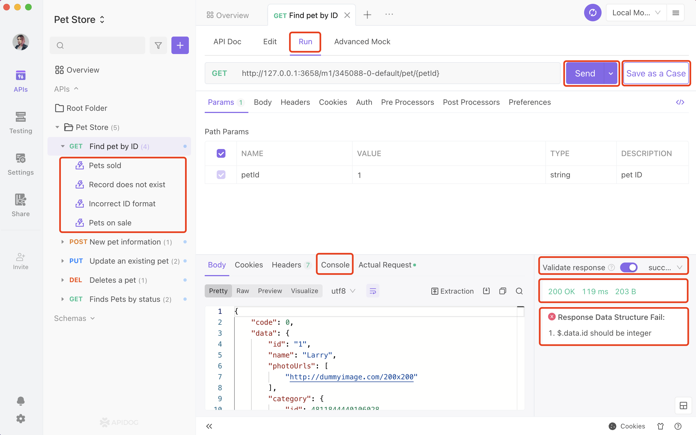
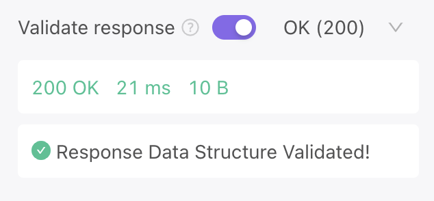

# API Debugging/API Use Case

After the API documentation is completed, you can start debugging your APIs.

:::tip Please be aware that:

Apidog, in contrast to Postman, makes a distinction between the ideas of API design and API execution.

- API design: The New API page and the API Detailed Settings page are designed for defining API documentation instead of executing the API. Therefore, these pages can only be used to define the basic information of the API (parameter names and parameter descriptions, etc.) instead of set parameter values. Please set parameter value, PreProcessor script, PostProcessor script, etc. on the API execution page.

- API execution: The API execution page (accessed from API Detailed Settings page) is designed for temporary debugging. After execution, click on save as a use case to save parameters, pre-processor scripts, post-processor scripts, etc. Otherwise, the information will be lost after closing the tab.

:::

:::tip Common Problems

- How to quickly debug without designing the API in advance like Postman?
  Use the Quick Request features.

- How do I prevent the tab from being overwritten when I open a new API?
  Double-click on the tab or double-click the content in the tree menu. This is similar to how to do it in VS code. After modifying the contents of the tab, it will automatically fix the tab.

:::

## Quick Start

Go to API detailed settings, and click on the execution tab.

## Save as Use Case

Save as a use case is to save the current settings for later use or to help others debug the API. After saving a use case, API use cases will be displayed in the tree menu on the left-hand side.

:::tip Please be aware that:

- API use cases are beneficial. It is recommended that it is very efficient for developers to re-use it for debugging purposes.

- An API typically has numerous use cases, such as the parameter's use case being correct, the parameter's use case being incorrect, the parameter being empty, the parameter state being different, etc.

:::

## API Parameters

The API path and parameter names are automatically read from the API design during execution without requiring manual input. The parameter values are automatically read from the default example values in the API design with the option of manual modification.

After filling in the parameters, click on Send to run.

## Return Response

The system uses a return response to determine whether the data returned complies with the response specified in the data structure. It is more efficient and accurate, and it eliminates manual review.

Data Structure Verification Results

The system automatically checks to see if the data returned after the run is accurate and provides a detailed error based on the data structure of the selected return response.

## Assertions

The post-processor supports assertions. You can set assertions on the data (or response time) returned by the API to determine if it meets expectations. View more about assertions here.

## Extracting Value for Variables

The post-processor supports extracting values for variables. You can extract data from the API returned response and set them to variables (temporary variables/environment variables/global variables), which can be used directly by other API. View the documentation of the extracting values for variables here.

## Console

The console is designed to aid debugging. The console displays debugging log and error information of a script during runtime.