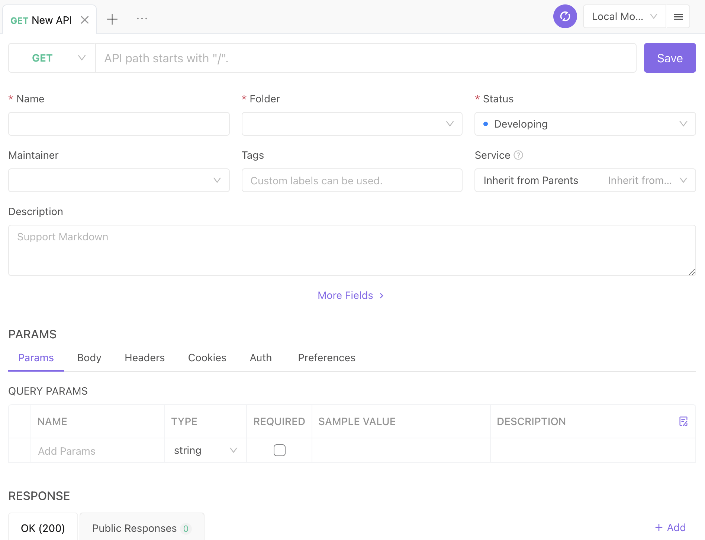
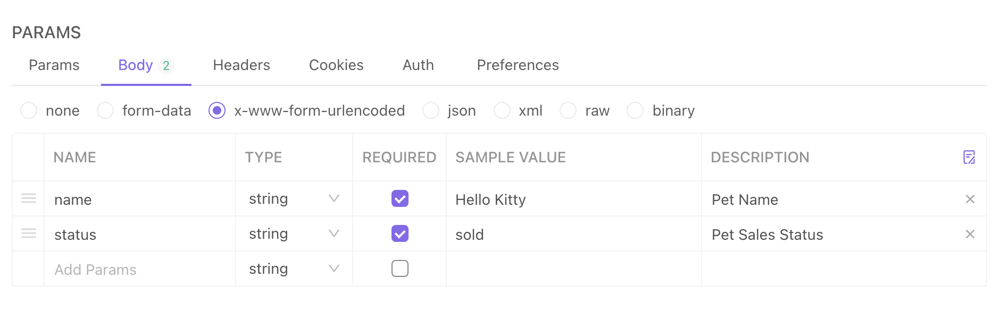
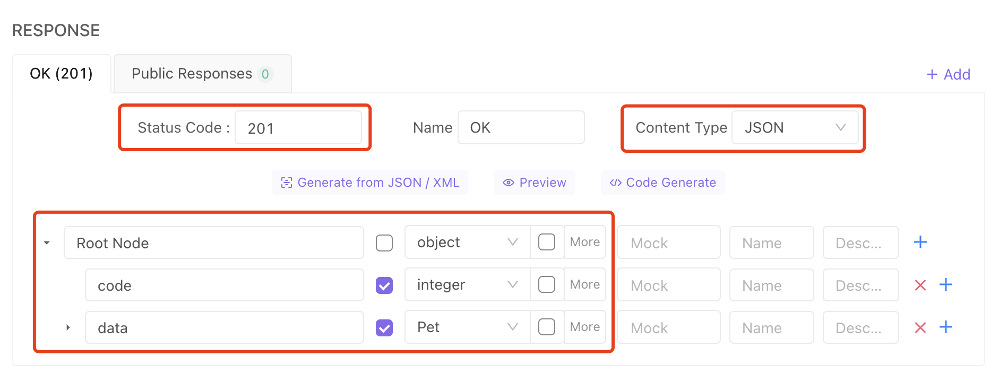
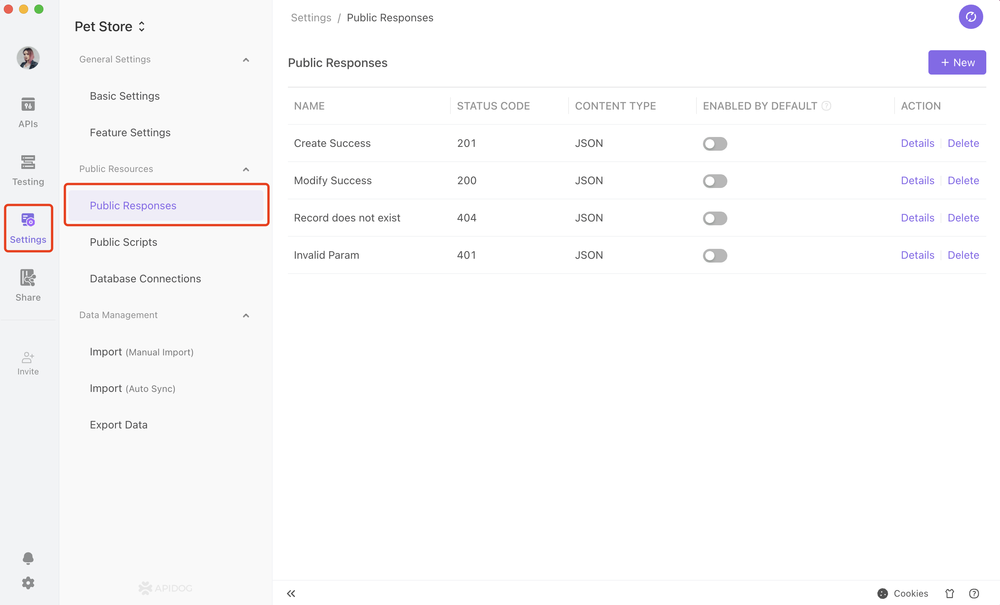
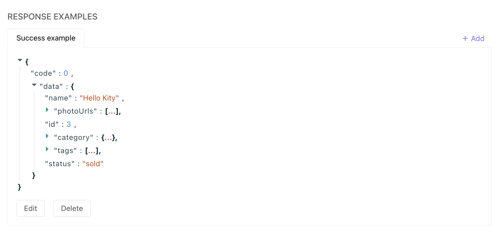
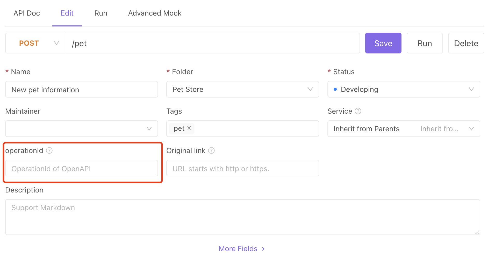

# API Design (API Documentation)

API Design defines API documentation specifications (e.g., API path, parameters, return values, data structures, etc.).

:::tip Please be aware that:

Apidog, in contrast to Postman, makes a distinction between the ideas of API design and API execution.

- API design: The New API page and the API Detailed Settings page are designed for defining API documentation instead of executing the API. Therefore, these pages can only be used to define the basic information of the API (parameter names and parameter descriptions, etc.) instead of set parameter values. Please set parameter value, PreProcessor script, PostProcessor script, etc. on the API execution page.

- API execution: The API execution page (accessed from API Detailed Settings page) is designed for temporary debugging. After execution, click on save as a use case to save parameters, PreProcessor scripts, PostProcessor scripts, etc. Otherwise, the information will be lost after closing the tab.

:::

:::tip Common Problems

- How to quickly debug without designing the API in advance like Postman?
  Use the Quick Request features.

- How do I prevent the tab from being overwritten when I open a new API?
  Double-click on the tab or double-click the content in the tree menu. This is similar to how to do it in VS code. After modifying the contents of the tab, it will automatically fix the tab.

:::

## Quick Start

1. Click on the + button next to the search box on the left to open a new window, or use the shortcut Ctrl(⌘) + N.

2. Define the API-related information in the window.

## API Path

API path starts with a slash /, such as /pets, /pets/{id}.

:::tip Please be aware that:

1. We suggest not including the HTTP protocol and domain name in the API path. This should be set in the predecessor URL in the environment management section. The preprocessor URL of the current environment will be automatically added to the URL during debugging.

2. Although the system can accommodate special circumstances when the HTTP protocol and domain name are required in the API path, it is not recommended. During debugging, if the system detects that the API path starts with http:// or https://, it will automatically ignore the predecessor URL in the current environment.

3. In Apidog, the Path parameter is wrapped by curly brackets (for example, /pets/{id}) instead of starting a colon (for example,/pets/:id ).

4. API path cannot contain query parameter (the parameter after the ''?'' in the URL). Query parameters should be filled in the request parameters section below.

:::

## Request Parameters

### Params

Params include query and path parameters.

- Query Param: the parameter after the ''?'' in the URL.
- Path Param: Automatically extract the path parameter in the curly bracket. For example, Apidog extracts {id} as the path parameter in /pets/{id}.

### Body Param

#### Body Parameter Types

- none: no body parameters.
- form-data: when the content-type is multipart/form-data.
- x-www-form-urlencoded: when the content-type is application/x-www-form-urlencoded.
- json: when the Content-Type is application/json.
- xml: when Content-Type is application/xml.
- binary: when sending file-based data.
- raw: when sending other text-based data.

:::tip Please be aware that:

- The body parameter can only be set to none for GET requests.

- When the body parameter type is json or xml, you will need to set the data structure, and the data structure can refer to the data model. View documentation for details.

:::

:::tip Please be aware that:

- There is no need to manually set the Content-Type when sending an API request because it is automatically added to the request header based on the Body parameter type.

- If you need to manually set the Content-Type in the Header, the value must match the Body parameter type. Otherwise, the system will automatically ignore the Content-Type entered manually.

  - When the body parameter is form-data, you can manually set the content type as multipart/form-data; charset=GBK. However, if the content type is set to be application/json, the system will ignore it since it does not match the parameter type.

  - When the body parameter is raw, there is no restriction on manually setting the value of Content-Type.

:::

## Using Environment Variable/Global Variable/Temporary Variable in Parameters

:::tip v-pre

You can use variables for all parameters. Using double curly brackets to wrap the variable name to reference a variable. For example, {{my_variable}} means referencing a variable named my_variable.

Parameter values can contain strings other than variables. For example, you can set a parameter as prefix-{{my_variable}}-surfix. During runtime, the value of the parameter would be prefix-123-surfix.

:::

View the documentation for more details regarding variables.

## Return Response

Response returned include the following parts:

- The HTTP response status code returned by the API
- The data format of the content returned: JSON,XML,HTML,Raw,Binary
- Data Structure: Only JSON and XML can configure data structure. View details for data structure here.

:::tip Please be aware that:

- Multiple return responses can be set when an API returns different data structures in different situations. To add a response, click + New at the top right of the Return Response module.

- After defining the data structure, the system will automatically check whether the returned data conforms to the defined data structure when debugging the API. View details of API Debugging/API Use Case here.

- After the data structure is defined, the system will mock realistic data based on the customized data structure when using mock. View more details of Mock data here.

:::

## Public Response

Public response is designed to reuse return response.

Sometimes, different API will return the same data structure, such as the resource does not exist (404), no access rights (401), etc. We suggest setting these as public responses to avoid duplication and easy management.

How to save as a public response: Open Project Settings->Public Response and manage the public response here.

## Example

Set up data examples for the return response to help those reviewing the API documentation quickly comprehend the data structure.

The data examples of the return response can also be set up multiple times by clicking + New at the top right of the Response sample module. We suggest setting at least two examples: a successful one and a failed one.

## Other

### OperationID

Support setting the OperationId property. When exporting as OpenAPI format, the parcel will be exported to the OperationId of the Operation object.

