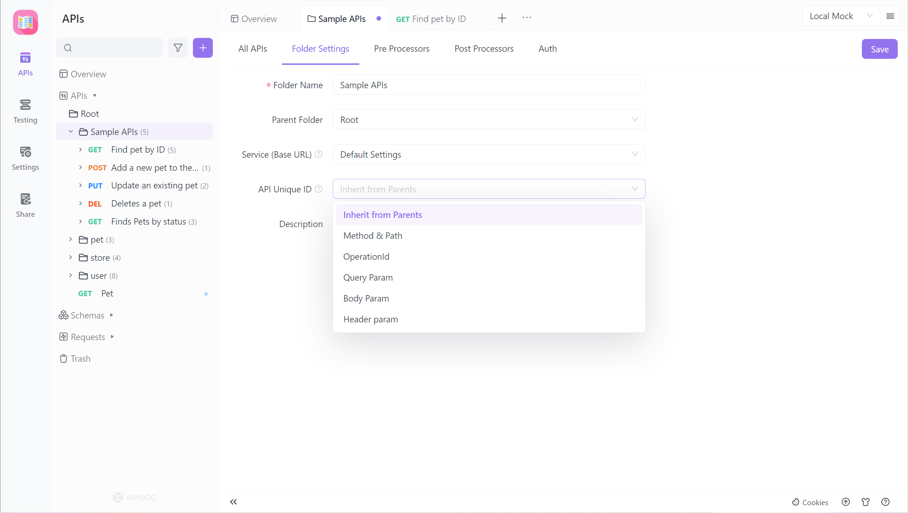
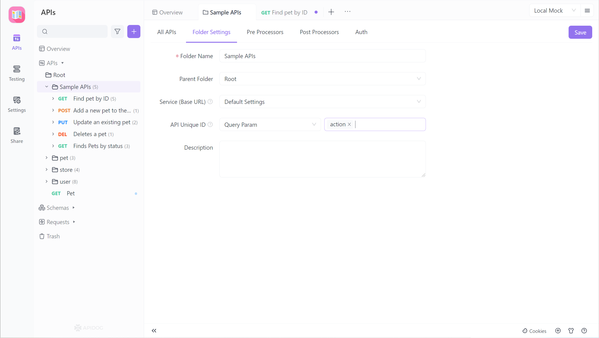
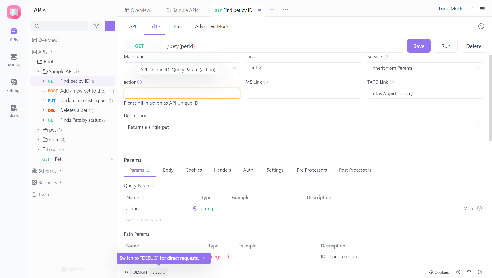
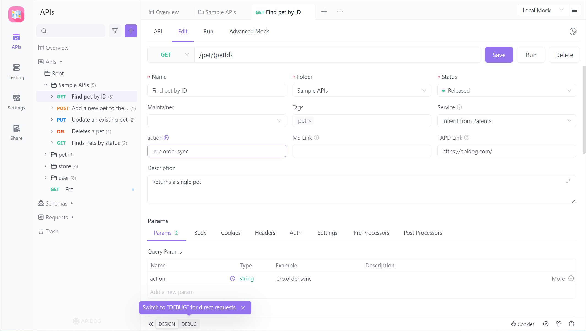
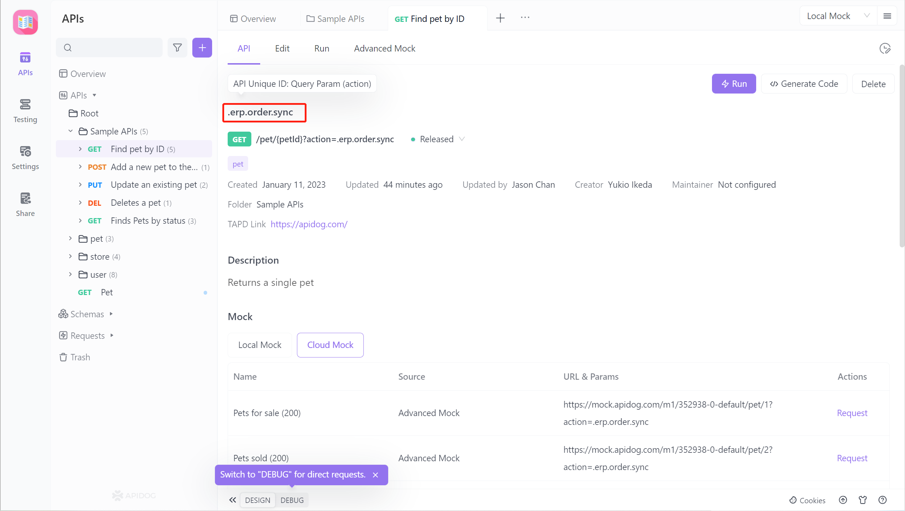
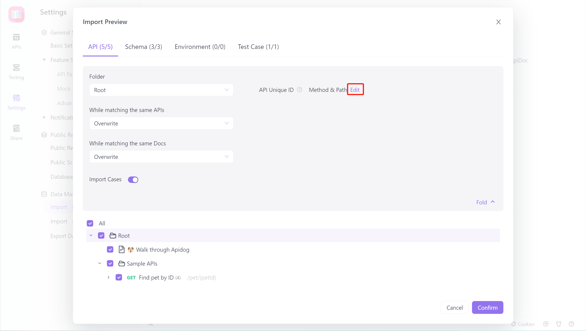
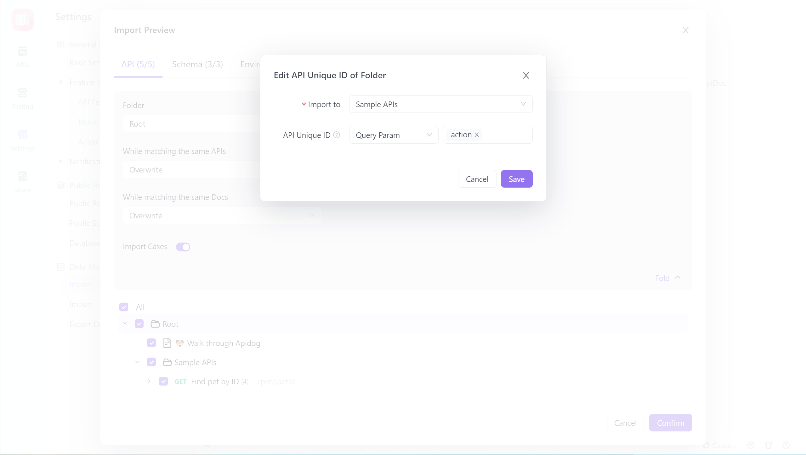
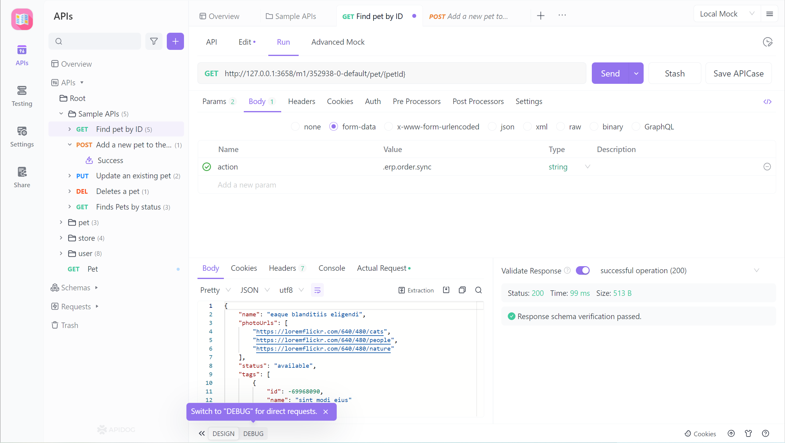

# Interface Unique Identification

Currently, most interfaces are differentiated based on the `method and path`. However, some development projects (such as some e-commerce API documents) use a fixed URL for the interface request and differentiate between interfaces using parameters in the Query / Header.

After version 2.2.9, Apidog added the `Interface Unique Identification` feature, which supports `operationId`, `Query parameters`, `Body parameters`, and `Header parameters` as parameters to differentiate between interfaces.

## 1. Setting Interface Unique Identification

`Interface Unique Identification` is defined as a set at the `directory` level. When you need to set an interface as a unique identification, you need to set it in its `parent directory`. Choose the unique identification parameter you need according to your needs, and after clicking save, it will take effect on all interfaces under that directory.

 

Example: An e-commerce API interface uses the action parameter in the Query parameter as the parameter for the `Unique interface identification`. After selecting the`Query parameter` in the figure below, enter the corresponding parameter name in the input box on the right.   

 

## 2. Fill in the corresponding Parameter Value for the Unique Identifier

After setting the Unique Interface Identification for the directory, click on an interface under that directory, click the `Edit` tab, and in both the basic information and request parameters at the bottom of the interface, there is an icon of `K`, which represents the parameter for the `Unique Interface Identification`. 

 

You can enter the corresponding value under the corresponding parameter as the value for the Unique Interface Identification.  

## 3. Display the Unique Identifier on the Document Page

After filling in the value for the Unique Interface Identification on the `Edit` page of the interface, it will be displayed as shown below on the Documents page and in the Online Documentation. 

 

## 4. Import

If you use parameters in Query/Header to distinguish between interfaces in your project and import an OpenAPI-formatted file into Apidog, the following page will appear.

The rule for matching interfaces during import is subject to the settings of the target directory. If the setting of the Unique Interface Identification in the target directory does not meet the requirements, you can modify it in the import settings. After modification, it will take effect directly on the target directory

Example: An e-commerce API interface uses the action parameter in the Query parameter as the parameter for the Unique Interface Identification On the following page, click `Edit` to modify the Unique Interface Identification when importing Apidog.

Note:

1. Users who have used the `Fixed Value` in Query parameters need not worry because this function will still be retained. However, when importing, the `Fixed Value` is judged based on the URL, so it is recommended that users who have used the `Fixed Value` use the Unique Interface Identification.
2. The Unique Interface Identification supports setting multiple parameters.
3. If only a subdirectory in your directory is set as the `Unique Interface Identification`, when importing Swagger and updating all directories, please avoid importing all projects to the root directory for updating. It is recommended to import interfaces set as `Unique Interface Identification` separately into that special

## 5. Mock Data

Starting from version 2.2.24, if the API has set the `unique identifier` as `Body Parameter` or `Header Parameter`, you need to send the `path + parameter name and value of the unique identifier` to get the corresponding Mock Data.

Note:

1. When accessing Mock Data during development, frontend developers also need to send the `path + parameter name and value of the unique identifier` if the API has set the `unique identifier` as `Body Parameter` or `Header Parameter`.
2. For projects that have a `unique identifier` for APIs, the API documentation needs to be standardized to avoid cases where APIs have the same URL but do not have a `unique identifier` set. This is to avoid the failure of obtaining Mock Data correctly.