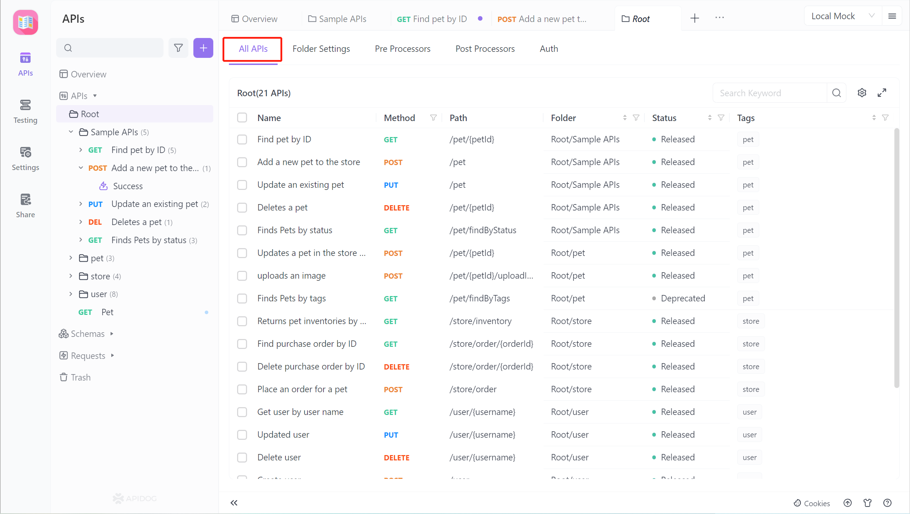
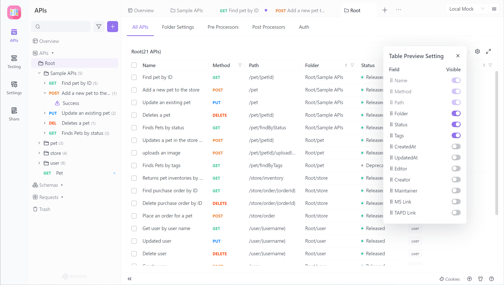
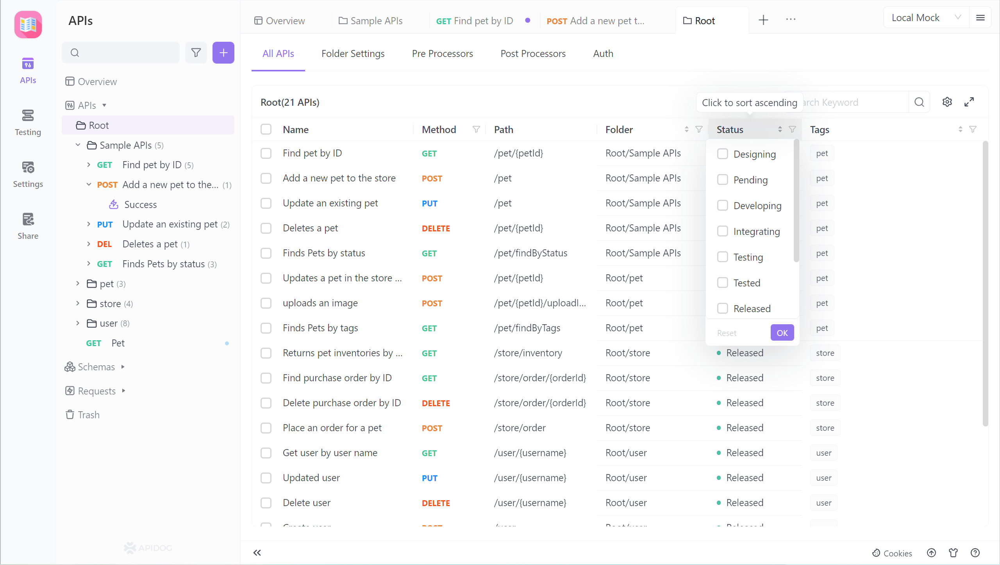
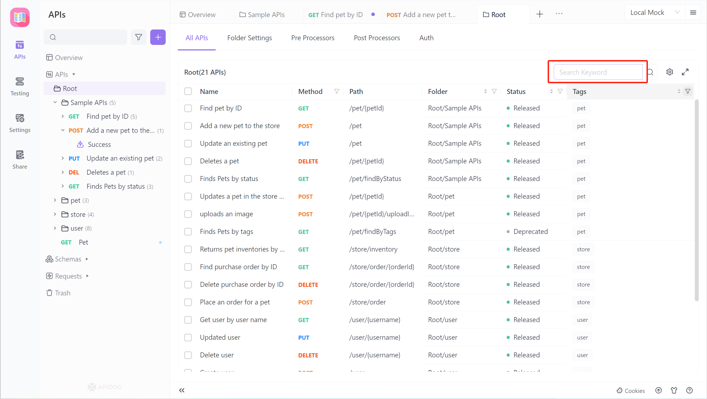
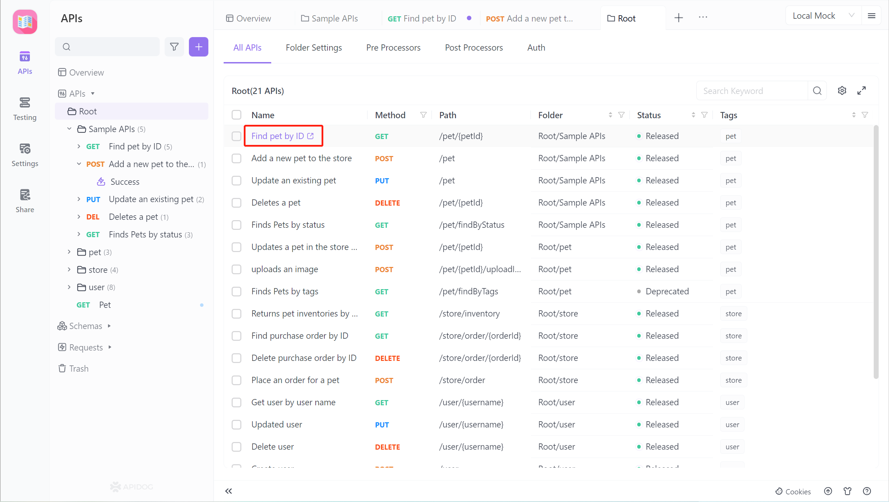
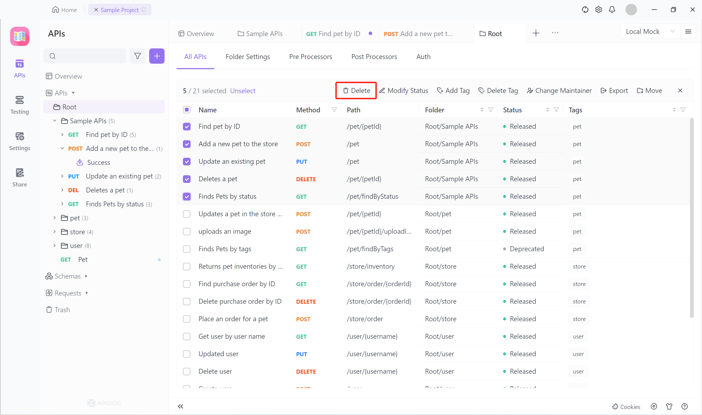

# Bulk Interface Management

To improve the ability of interface management, the `Bulk Interface Management` feature has been added in versions after 2.2.19.

You can browse all interface documentation under a directory on the `All APIs` tab and perform bulk operations such as `bulk deletion` and bulk movement.

## Browse All Interface

1. If you need to view all interfaces of the current project, click the `All APIs` tab under the `Root Directory`. If you need to view all interfaces under a specific directory/microservice, click on the corresponding directory. 

   

2. Based on the interface documentation you need to view, you can modify the `Table Preview Settings` to display `custom fields`.

   

3. After setting up the table header, you can filter and sort the data table according to your needs. Multiple sorting conditions can be added.

   

4. The `All APIs` tab supports keyword searches for interface names and interface paths.

   

5. When you need to view the fields in detail in the interface documentation, click on the interface name/interface path.

   

## Bulk Interface Operations

First, select multiple interface documents that you need to operate on.!

Then perform batch processing according to your needs. `Bulk deletion`, bulk modification of interface status, bulk addition of tags, bulk deletion of tags, bulk modification of responsible personnel, bulk export, and bulk movement of directories are supported.!

