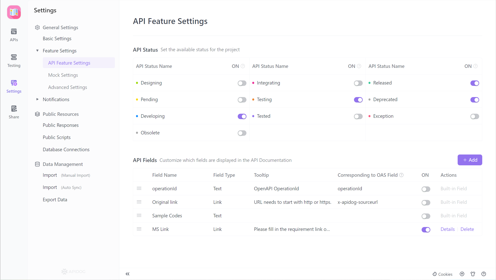
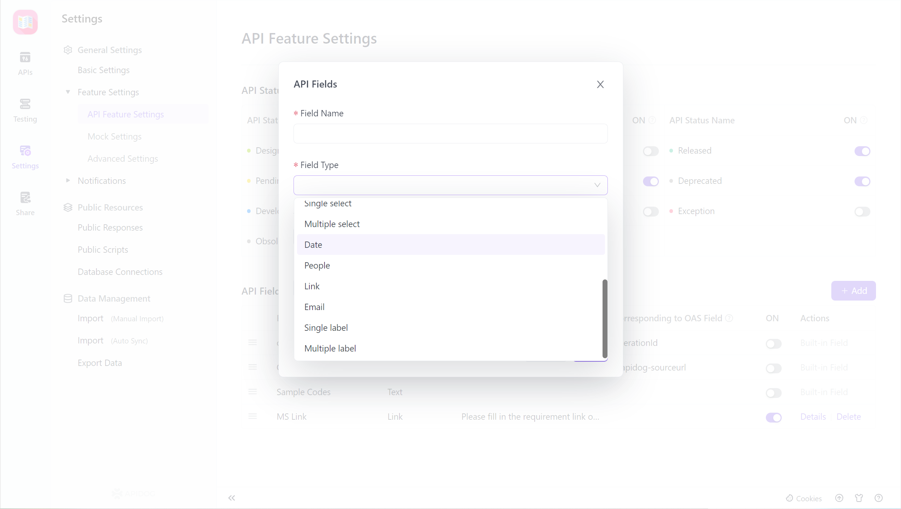
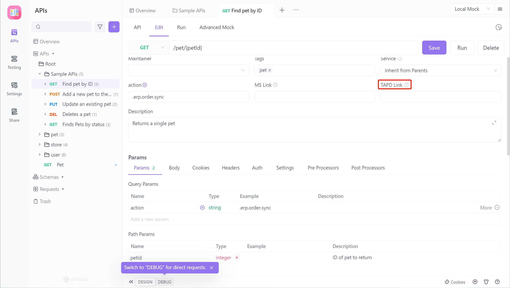
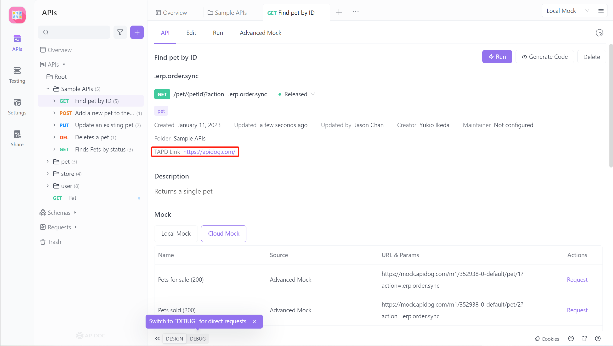

# Custom Fields

The `Custom Fields` feature allows project managers to set up common fields for API documents, such as creation time, TAPD link, requirement document link, etc., making project management more convenient.

## Configuring Custom Fields - Manager

In the `Project Settings > Feature Settings` section, managers can configure `Custom Fields` according to project needs:

1. Field name: the name of the field.

2. Field type: supports text, number, single selection, multiple selection, date, project member, link, email, single selection tag, multiple selection tag (single and multiple selections supports manager to set options).

3. Prompt: displayed to project members, giving prompts when filling in the content.

4. Corresponding OpenAPI field: used when importing/exporting.

   OpenAPI/Swagger format data. If left blank, the field is ignored when importing/exporting OpenAPI/Swagger format data

5. Enable: managers can enable/disable the `Custom Fields` as needed.

## Filling in Custom Fields - Project Members

After configuring and enabling the `Custom Fields`, the `Modify Document Page` in the `API Document` will display the field, and project members can fill it in according to the requirements.

## Displaying Custom Fields

After configuring and filling in the `Custom Fields`, the corresponding information will be displayed on the `API Document` page.

