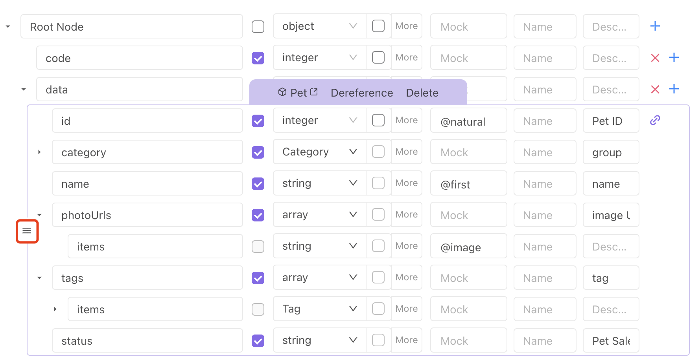

# Data Schema / Data Model

## Data Schema

The data model in Apidog is similar to the data model in any programming language. It is mainly used for return response and body parameters(json/xml format) in API design.

### Generate from JSON/XML

We support generating data structures automatically from JSON data. If you already have JSON data, you can generate data structures easily.

:::tip Please be aware

JSON smart recognition only generates the data structure, and the value in JSON will not be saved.
:::

### Edit Data Model

1. You can choose whether the field is required.

2. You can select the data type of the field.

3. You can edit the mock config for the field. View the documentation for more details on mock syntax.

4. You can add a new field or delete an existing field.

5. You can drag and drop the fields around to change their order.

6. We are building a productive way to fill in the instructions for the fields. Stay tuned!

## Data Structure

Data models are reusable data structures. When building a new data structure, you can choose an existing data model directly in the data type.

### Managing Data Structure

Before building the data model, you must first build the reusable data structure. As shown in the screenshot below, you can create a new data structure or manage the relationship of different data models under the data model section.

:::tip Please be aware
Data models can refer to each other.
:::

### Reference to Data Model

As shown in the screenshot below, you can select the established data model in data type under the body parameter(JSON/XML type) for return response in API design.

1. If the chosen data model does not meet the requirements, you can modify it directly in the data model tab.

2. When you only need to reference a data model partially, you can modify it directly, which will not change the original data model.

   - When a field in the data model does not apply to your use case, you can choose to hide the field, and the hidden field will not appear in your API doc.
   

   * When you need to change a field in a data model for specific use cases, you can choose to disconnect the field from the data model. You can always re-establish the connection later on.
   
   

3. You can reference multiple data models. Additionally, we support using drag-and-drop to sort the order of different data models.

### Preview

We support generating realistic data based on the data structure. You can view the results from the mock easily.

### Code Generation

We support code generation for multiple languages based on the data structure. View the documentation for more details on code generation.

### Editing Source Code

The data structure and data model in Apidog follow the JSON Schema specification. You can define data structure by editing your JSON Schema. View the documentation for more details on JSON Schema.
