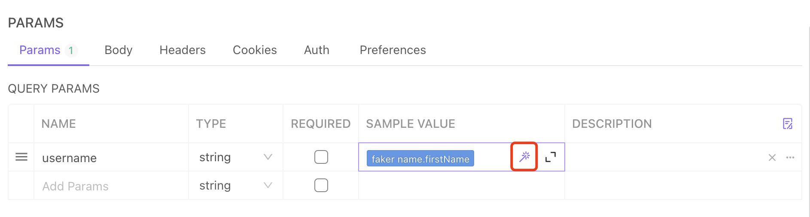
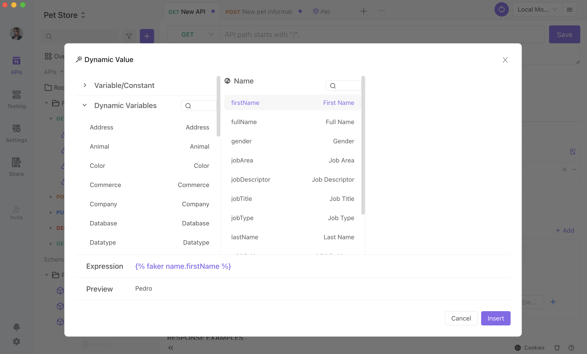
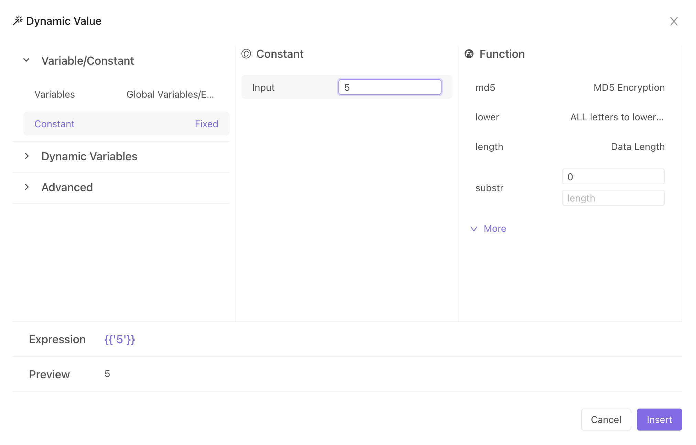
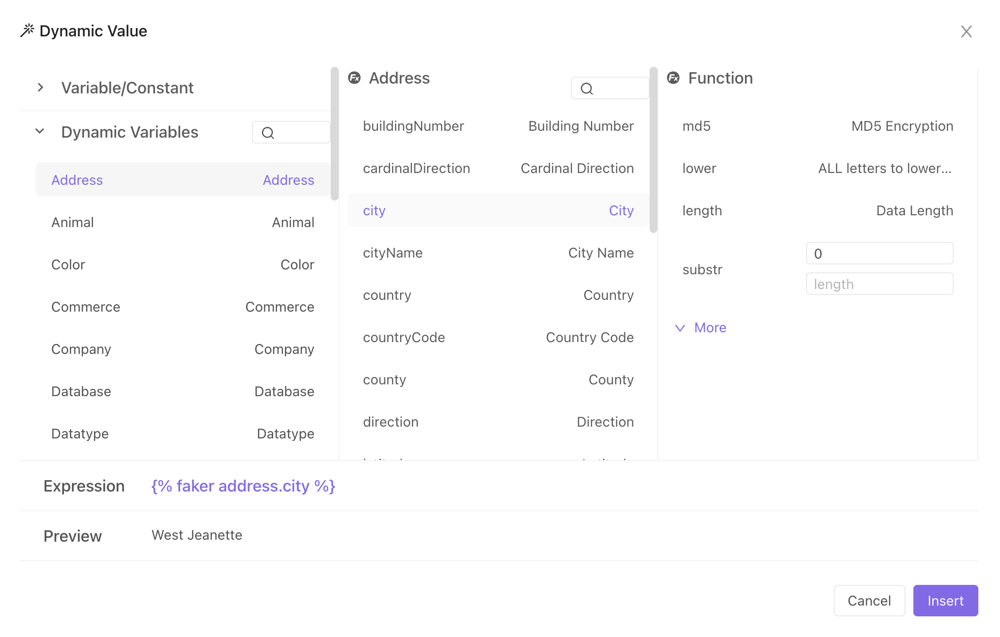
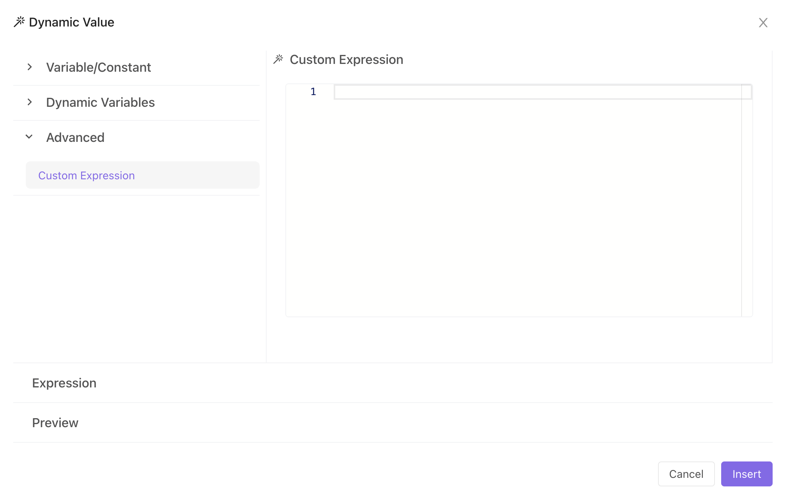
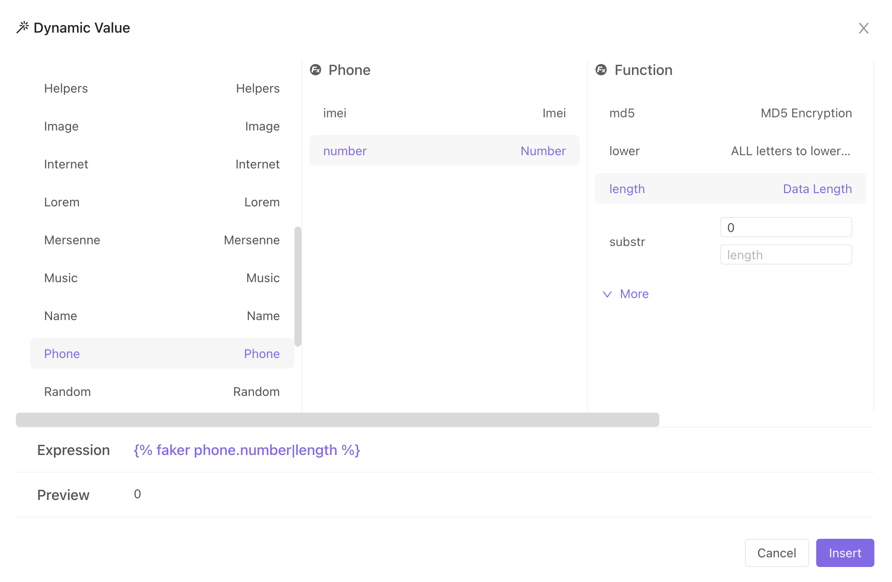
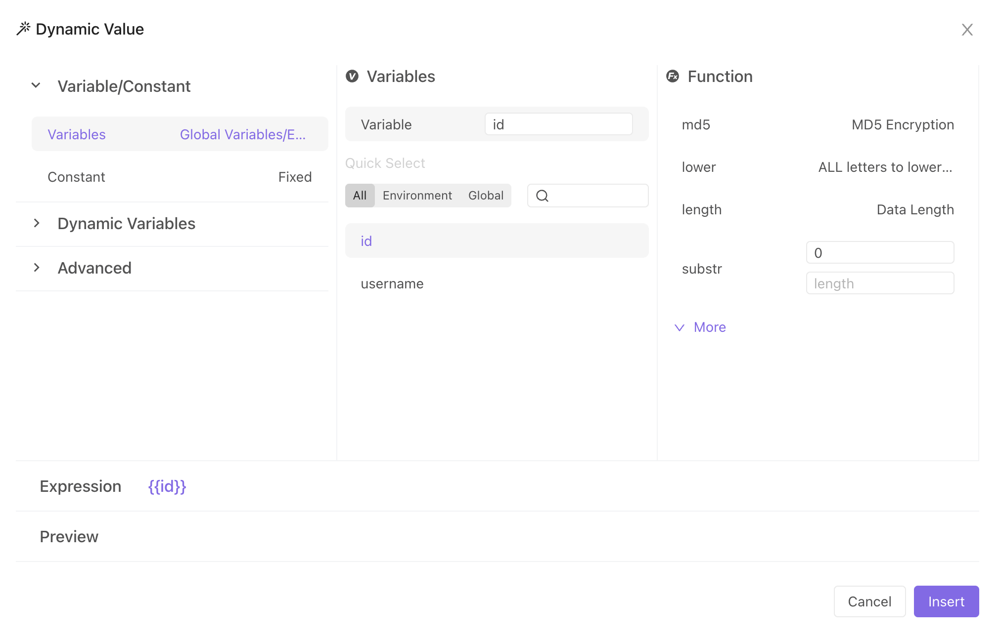

# Dynamic Variables/Random Parameters

The values of dynamic variables are generated at the time of execution based on certain rules.

## Operating Path

When the cursor is placed over the input box, a magic wand icon will appear at the location of the example value of the request parameter. Click on it to set the dynamic variable.

## User Instruction

1. Variables: You can use environment variables and global variables in environment management.

2. Constants: If you want to use the parameter's example value as a constant, you must first choose the constant from the dynamic value list before entering it in the form.

3. Dynamic Variables: If you want to generate a variable randomly, you can choose it here (as shown in the screenshot below). We support phone numbers, email, addresses, etc.

4. Customized expression: If none of the above meets your needs, you can set your own rules.

5. We support nested variables using functions for variables, constants, and dynamic variables.

