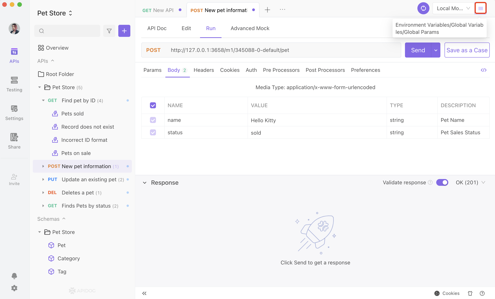
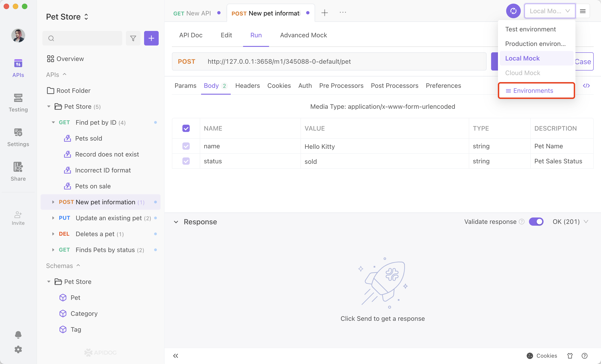
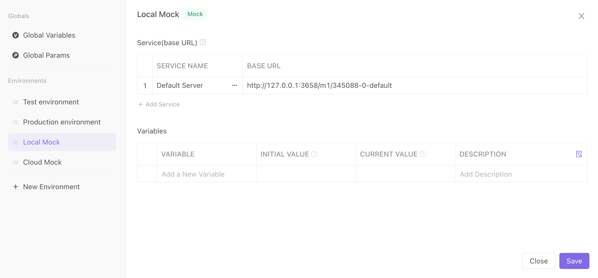
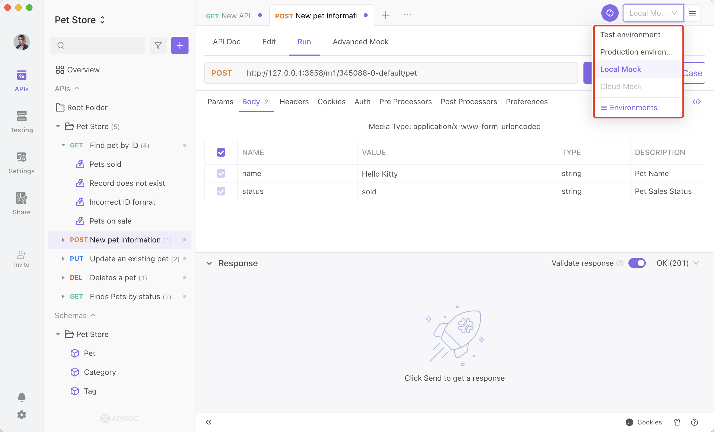

# Environment Management

A project will be in different environments at different stages, such as development, test, and production environment. Different environments usually have different base URLs, API parameter values, etc. It is very tedious to update the base URL and parameters frequently when the environment changes. With Apidog's environment management function, you only need to set different base URLs and parameters for different environments, and switch the environments when testing.

## Environment Setup

### Entry point for environment management

The entrance to the environment management section is in the page's upper right corner. The Environment Management portal can be accessed in one of two ways, as illustrated below.




### Environment Management Page

You can create or delete an environment on the left side and edit an environment on the right side.



### Features

1. base URL: base URL automatically gets added to the API path to form the URL of the actual request. For example, if the base URL is https://www.api.com and the path entry is /pets/123, the URL of the actual request is https://www.api.com/pets/123.
2. Environment Variables: Environment Variables are the variables that change when the environment changes. View details of environment variable/global variable/temporary variable here.
3. Additional Parameters: additional parameters automatically get added to all the API of a given environment. The value of additional parameters can refer to environment variables/global variables/temporary variables.

:::tip Please be aware that:

1. We suggest not adding / at the end of the base URL and adding the / at the beginning of the entry path when designing the API.
2. If the API path starts with http:// or https://, the base URL will not be added to the actual request. However, this is usually not recommended.

:::

:::tip Please be aware that:

- The system has a built-in special environment variable named BASE_URL, whose value is the base URL of the current environment. It can be accessed by {{BASE_URL}}.
- If you manually add an environment variable named BASE_URL, it will override the value of the system built-in BASE_URL.
- You can access the base URL through script by pm.environment.get('BASE_URL').
- The script cannot modify the base URL. The script pm.environment.set('BASE_URL','xxx') generates a real environment variable named BASE_URL, without modifying the base URL.

:::

### Quickly Switching Environments

You can quickly switch to the environment you need in the upper right corner of the page.



## Services (Base URL)

Please do not add multiple services under normal circumstances.

Only when multiple API uses different base URLs under the same environment does multiple services need to be added. In this scenario, each Service should have a different base URL, and different API or groups should choose different services.

### The Difference Between Service and Environment

Usage Scenario

```js
Environment

  Development Environment
  Debugging Environment
  Pre-release Environment
  Production Environment

Service

  User Service (user.xxx.com): Log in and other API
  Transaction Service(trade.xxx.com): Transaction-related Service
  Streaming Service (live.xxx.com): Streaming-related Service

```

### Service Setup

You can enter the base URL on the Environment Management page.

### Using Service

1. In the group settings, you can set different services in the current environment (recommended).

2. In the API Document - Modify Document, you can set different services in the current environment.

## Environment Variables

View how to use environment variables here.
