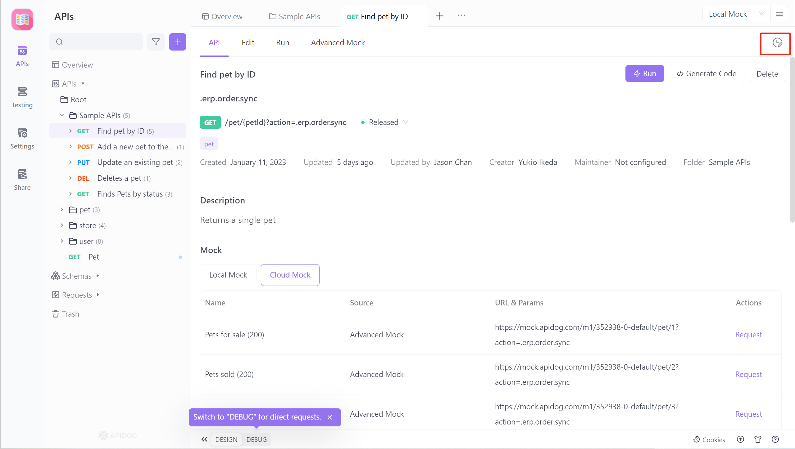
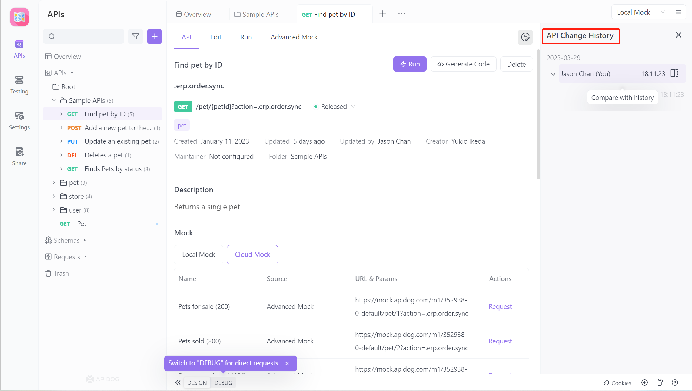
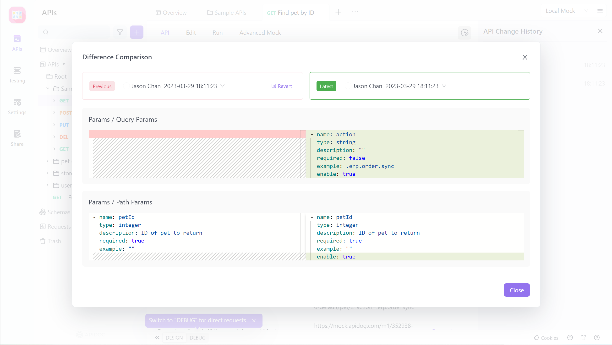
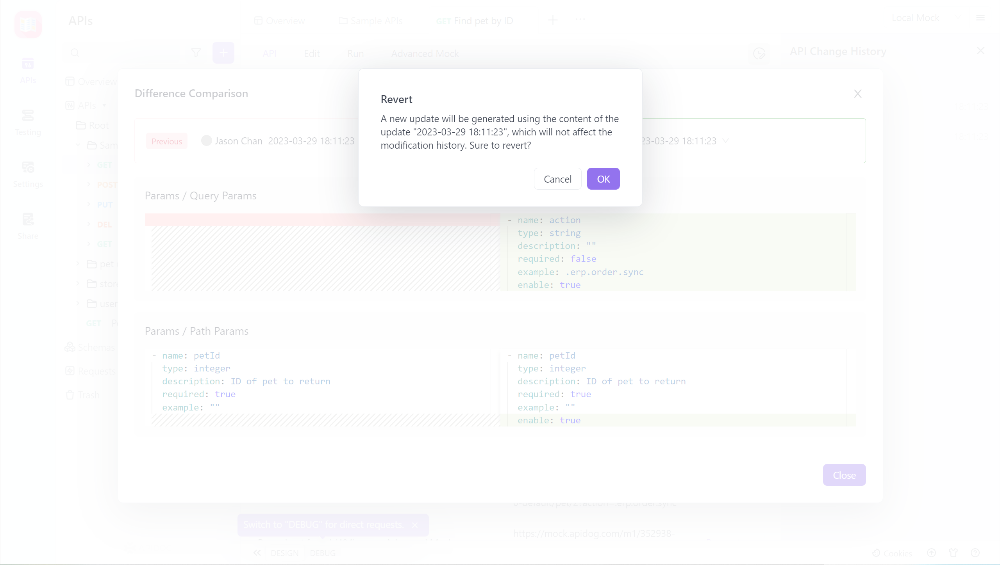

# Change History

The `API Change History` feature was added in version 2.2.18 to better support team collaboration scenarios.

The `API Change History` records team members' `modifications` to various fields of an interface, as well as modifications to the interface document caused by `import overrides`. It also supports `comparison` of differences before and after modification, allowing you to revert to any historical version.

## Quick Start

To view the `API Change History`, click on the icon in the upper right corner of the `API Document` to expand the `API Change History`. 

Clicking on a record displays the changes to each field before and after the operation.

If you need to restore to the previous version, click `Revert`, which will generate a new version based on the historical version used, and the original modification history will not be affected.

