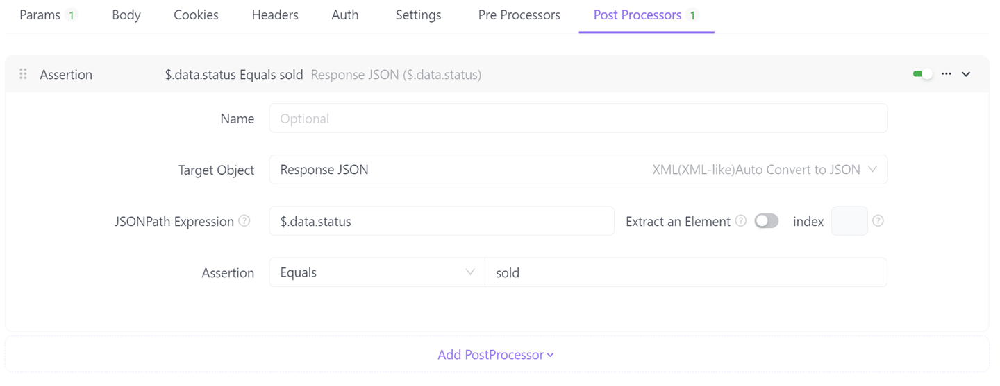
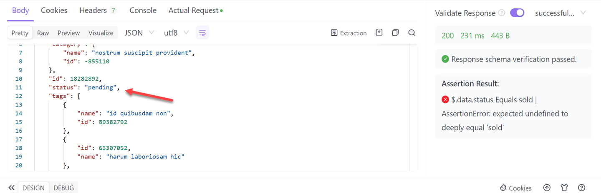

# Asserts

Postprocessor operation supports assertions. Assertions can be set on the data (or response time) returned by the API to determine if it meets expectations.

## Example

Set assertions.

View the assertion results after running.

# Extracting Value for Variables

The post-processor supports extracting values for variables. You can extract data from the API returned response and set them to variables (temporary variables/environment variables/global variables), which can be used directly by other API.

## Example
