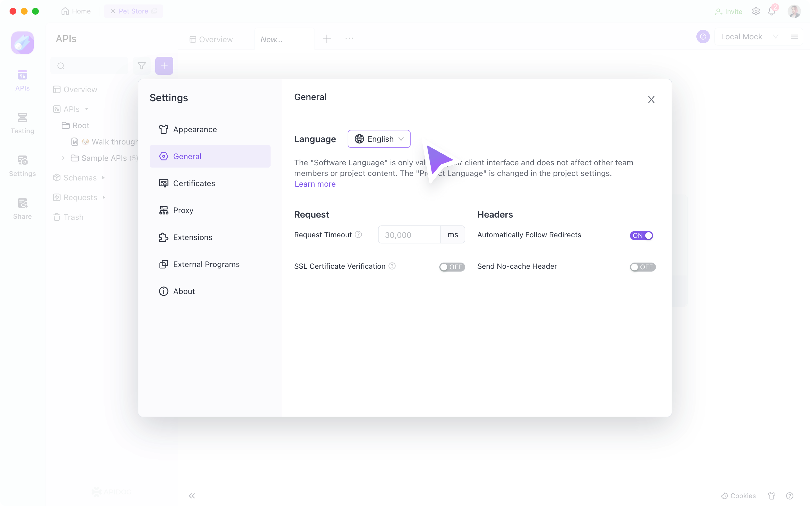
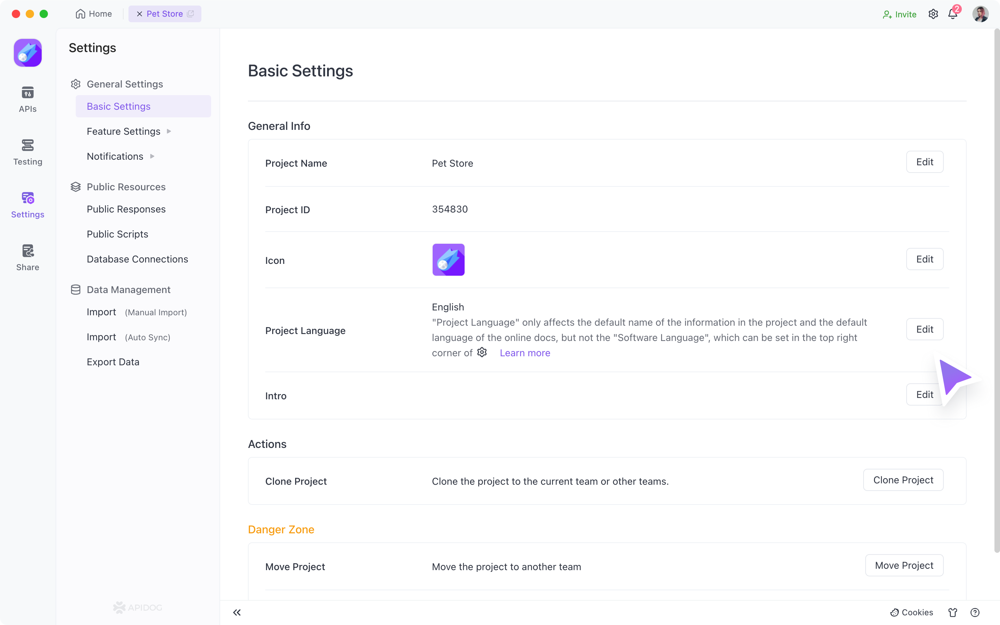
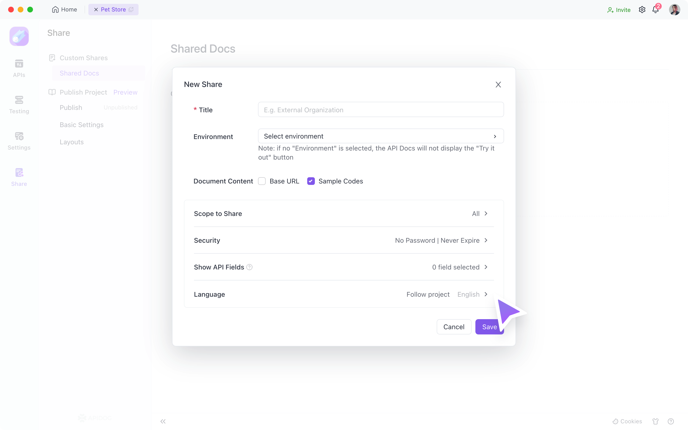

# Language Settings

To better support international teams in their development work, Apidog offers language settings in three dimensions.

## Software  Languages

The`Software language`  refers to the language displayed on the software tool's interface. It can be set under `Settings > General > Software Language` in the upper right corner of the tool. This setting only affects local use and will not impact other team members or the `Online Documentation`.

## Project Language

The `Project Language` refers to the default language for automatically generated names within the project, including the default names for `Response`, `Response Examples`, `Interface Use Cases`, `Markdown Documents`, and `Test Data` default dataset names.

It can be set under `Project Settings > Basic Settings > Project Language`, and only the project administrator has the authority to modify it. This setting does not affect the `Software Language`. The `Project Language` is saved at the project level, so team members will use the same `Project Language`, including the `Online Documentation`.

:::tip
It is not possible to translate data that is manually entered into the interface documentation by switching the `Project Language`. This will need to be translated manually.
:::

## Document Language

The `Document Language` refers to the language provided by the tool on the `Online Documentation` (which can be understood as the `Software Language` on the `Online Documentation`). It can be set under `Online Sharing-Share List-Edit/New Analysis` on the left-hand side.

