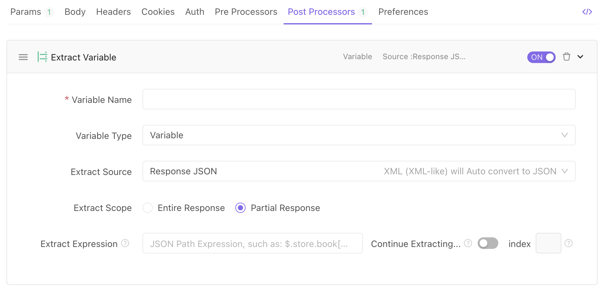

# How to pass data between APls

## Usage Scenario

API B's request parameters depend on the data returned by the API A. Therefore, API B needs the data returned by API A as request parameters before sending the request.

## How to Achieve it

1. We can extract the corresponding data returned by the request to a variable in the extract variable feature under the postprocessor operation tab.
2. API B can directly reference the variable above in the respective parameter.

## Implementation Example

### 1. Add variable extraction in postprocessor operation for API A

In the postprocessor tab for API A, fill in the information for extract variable feature as shown in the screenshot below. Extract the token value from the Response JSON to the temporary variable (environment variable, or global variable) token.

### 2. Reference the Variable in API B

Fill in {{token}} to the corresponding parameter value to reference the variable.
