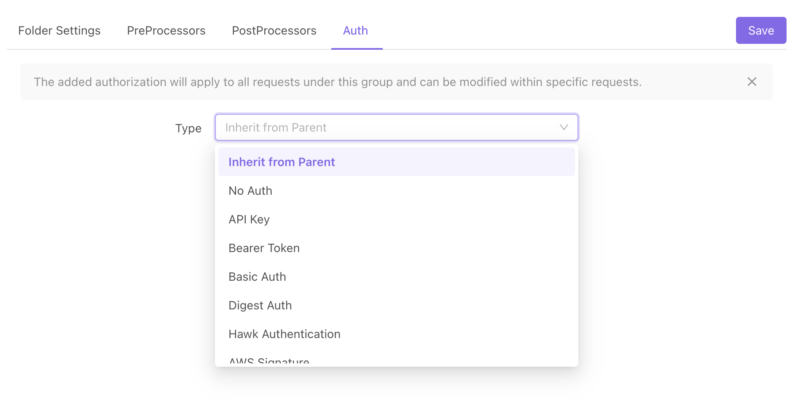

# How to handle auth state

## Common Methods

### 1. Session/Cookie Method

Apidog will automatically maintain auth state through session/cookie.

Usage:

- After the login API is executed, the global Cookie will save the returned Session/Cookie info.
- When running other APIs, the Session/Cookie info will automatically be attached.

:::tip Please be aware that:

You can find the details of how to achieve auto login via Session/Cookie below.

:::

### 2. Token Method

The Token method is to put the login credentials in the API request parameters (usually in the Header). Common methods include Basic Auth, Bearer Token, API Key, etc.

Usage:

- Method 1: Set auth information through in the global (project overview page), group (group settings), and API (documentation page). We support the following auth types shown in the screenshot below. \


* Method 2: Manually write the token into the Header or other corresponding parameters. Environment variables are recommended for storing the token. See example below:

  - Bearer Token: Set a Header named Authorization with the value Bearer eyJhbGciOiJIUzI1NiIsInR5cCI6IkpXVCJ9yJpZCI6, or use an environment variable and set the value as Bearer {{AUTH_TOKEN}}.

* Method 3: Set the value in global parameters. All the API will automatically include global parameters during runtime. Therefore, there is no need to set them manually for each API.

:::tip Please be aware that:

You can find the details of how to achieve auto login via token below.

:::

### 3. Auto Login Method

The login API is automatically invoked to complete the login without the need of manual operation.

## How to achieve auto login

### Expected Outcome

1. The login API is automatically invoked to complete the login without the need of manual operation.
2. After a successful login, it saves the auth state to avoid calling the login API again.

### How to achieve it

1. Use an environment variable (e.g., ACCESS_TOKEN) to save the credentials needed for login.
2. If the credentials have an expiration time, use an environment variable (e.g., ACCESS_TOKEN_EXPIRES) to save the expiration time of the login credentials.
3. Create a public script to the following:
   1. The script will determine whether the environment variable ACCESS_TOKEN has a value and whether ACCESS_TOKEN_EXPIRES is expired. If the value exists and is not expired, skip to execution. Otherwise, move to the next step.
   2. Use pm.sendRequest to call the login API, and write the returned login credentials and the expiration time to the environment variable.
4. Configure the API that needs auth state:
   1. Set the value of the parameter used to verify the auth state to {{ACCESS_TOKEN}}.
      - Set the Authorization in the header to {{ACCESS_TOKEN}}. You can also use cookies or other location parameters. Please choose the one that best fits your needs.
      - Set the value in global parameters. All the API will automatically include global parameters during runtime. Therefore, there is no need to set them manually for each API.
   2. References the public script created above in the preprocessor script.

### Public Script Example

:::tip Please be aware that:

- The login username and password in the script below come from the environment variables LOGIN_USERNAME and LOGIN_PASSWORD. Please remember to set these two environment variables manually if you copy the code directly.
- If your token does not expire, remove code related to ACCESS_TOKEN_EXPIRES.
- View documentation for [pm.sendrequest here. ](https://apidog.com/help/app/scripts/api-references/pm-reference/#pm-sendrequest)
- View documentation for [pm.cookies ](https://apidog.com/help/app/scripts/api-references/pm-reference/#pm-cookies)here.

:::

```js
// Define the method for sending login request
function sendLoginRequest() {
  // Get the base_url in the environment variable
  const baseUrl = pm.environment.get("BASE_URL");

 // Get the  username from environment variable LOGIN_USERNAME
  const username = pm.environment.get("LOGIN_USERNAME");

  // Get the  password from environment variable LOGIN_PASSWORD
  const password = pm.environment.get("LOGIN_PASSWORD");

  // Construct a  POST request x-www-form-urlencoded. You will need to modify the request parameters as needed.
  const loginRequest = {
    url: baseUrl + "/api/v1/login",
    method: "POST",
    // body: x-www-form-urlencoded format.
    body: {
      mode: "urlencoded",
      urlencoded: [
        { key: "account", value: "apidog" },
        { key: "password", value: "123456" },
      ],
    },
    /*
    // body: form-data format
    body: {
      mode: 'formdata',
      formdata: [
        { key: 'account', value: 'apidog' },
        { key: 'password', value: '123456' }
      ]
    }

    // body: json format
    header: {
      "Content-Type": "application/json", // Add Content-Type to header.
    },
    body: {
      mode: 'raw',//
      raw: JSON.stringify({ account: 'apidog', password:'123456' }), // Serialized JSON string
    }

    // body: raw or json format
    body: {
      mode: 'raw',
      raw: 'body content',
    }
    */
  };

  // pm.sendrequest View documentation:  https://apidog.com/help/app/scripts/api-references/pm-reference/#pm-sendrequest
  pm.sendRequest(loginRequest, function(err, res) {
    if (err) {
      console.log(err);
    } else {
      // read the returned json data
      // If your token information is stored in a cookie, you can use res.cookies.get('token') to get it.
      // view documentation for cookies here: https://apidog.com/help/app/scripts/api-references/pm-reference/#pm-cookies
      const jsonData = res.json();
      // write accessToken into the environment variable ACCESS_TOKEN
      pm.environment.set("ACCESS_TOKEN", jsonData.data.accessToken);
      // write accessTokenExpires into the environment variable ACCESS_TOKEN_EXPIRES
      pm.environment.set(
        "ACCESS_TOKEN_EXPIRES",
        jsonData.data.accessTokenExpires
      );
    }
  });
}

// Get accessToken from the environment variable ACCESS_TOKEN
const accessToken = pm.environment.get("ACCESS_TOKEN");

// Get accessTokenExpires from the environment variable ACCESS_TOKEN_EXPIRES
const accessTokenExpires = pm.environment.get("ACCESS_TOKEN_EXPIRES");

// If ACCESS_TOKEN has no value, or ACCESS_TOKEN_EXPIRES has expired, send the login request.
if (
  !accessToken ||
  (accessTokenExpires && new Date(accessTokenExpires) &lt;= new Date())
) {
  sendLoginRequest();
}
```
