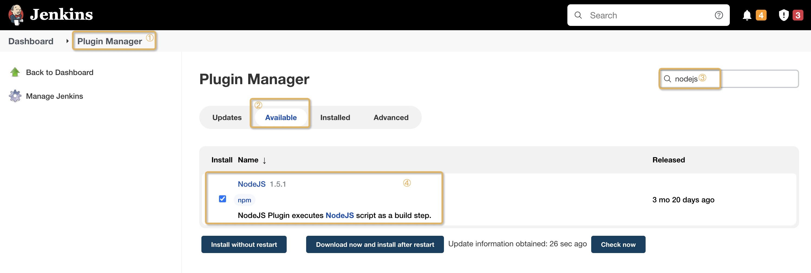
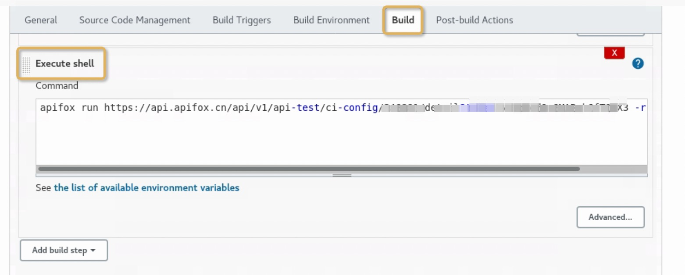
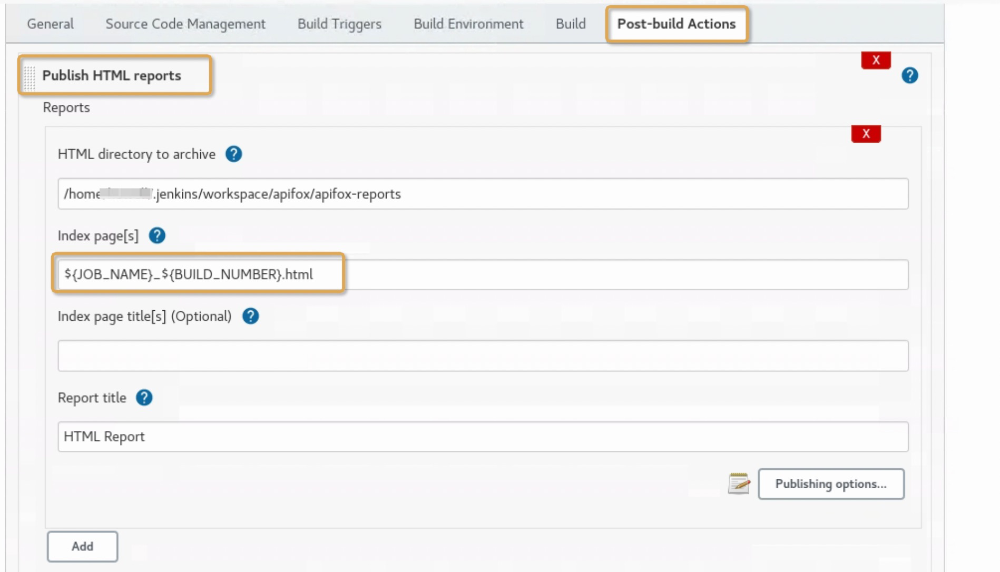

# Continuous Integration with Jenkins


## How to install


1. Install Jenkins on the server. View documentation on Jenkins here. 
2. Install apidog CLI on the server with Jenkins. 

## Node JS environment with Jenkins


1. Go to Plugin Manager to install Node JS plugin in Jenkins. 




2. Setup node configuration in Build Environment.


3. Create a new Jenkins task, go to Build - Execute Shell, copy and paste the apidogCli command, save it and run. 



## Publish Reports with Jenkins

Specify the generated report name `${JOB_NAME}_${BUILD_NUMBER}` ( Jenkins built-in variable) in the command. Use the `HTML Publisher` plugin to view the report. 



```js
apidog run https://api.apidog.com/api/v1/api-test/ci-config/XXX/detail?token=xxxxx -r html,cli --out-file ${JOB_NAME}_${BUILD_NUMBER}
```
