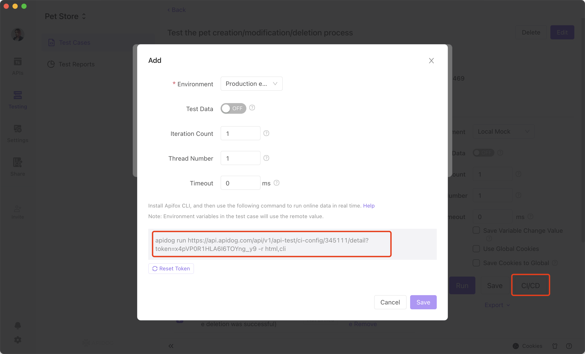
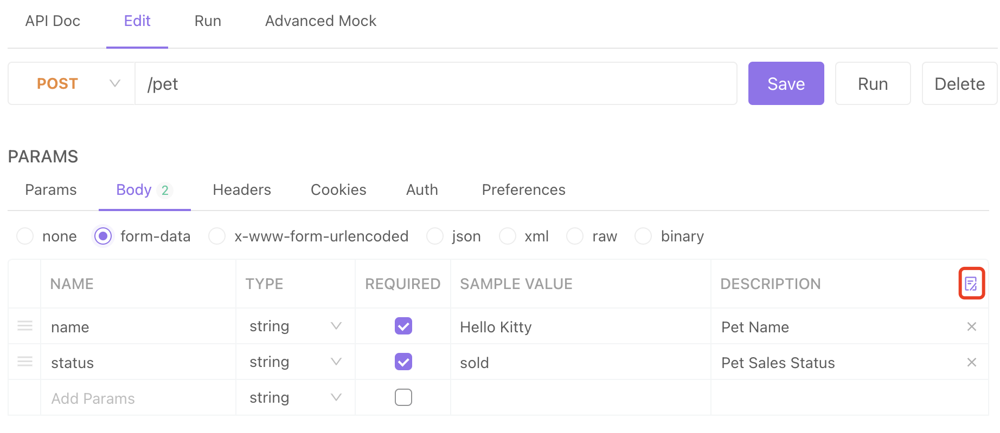
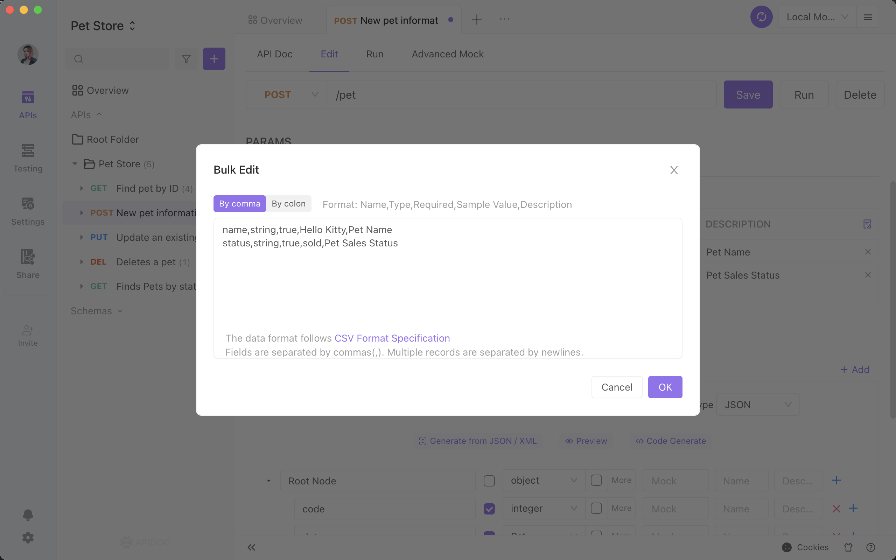

# Apidog CLI 

apidog CLI is mainly designed to run apidog test cases in the command line.


## Prerequisite 

apidog CLI requires Node.js with version 10 or higher. Please install Node.js. 


### How to Install apidog CLI

Use the command below to install:

```js
$ npm install -g apidog-cli
```


### Running with real-time data

Go to the test case page, click on continuous integration, copy the generated command, and run it in command line. 



```js
apidog run http://xxx/api/v1/api-test/ci-config/xxxx/detail?token=xxxx -r html,cli 
```


### Run test cases

```js
$ apidog run examples/sample.apidog-cli.json -r cli,html,json
```


The test report will be saved to the apidog-reports directory. 


*  If you want to customize the report, you can use the result in json file to customize the report as needed. 

### Continuous Integration with Jenkins


### How CLI passes file parameter 


1. First, go to the request parameter tab under API documentation - edit documentation, and use the bulk edit to set the file upload path to a variable. 



2. Save it as an API use case, and import the API use case in automated testing. 

3. Change the value of the path variable based respectively when running different applications


## Command-line Options


### `apidog [options]`

* `-h, --help` 
View help information.

* `-v, --version` 
Show apidog version.

### `apidog run <file-source> [options]`


`file-source` needs to be the path for `test cases` files exported from apidog.

More options: 


```js

  -r, --reporters [reporters]              Specify test report format. We support cli (default), html, json. 
  -n, --iteration-count &lt;n>             Set iteration count. 
  -d, --iteration-data &lt;path>           Set iteration data (JSON or CSV).
  --external-program-path &lt;path>        Specify external program path (default to the current working directory).
  --out-dir &lt;outDir>                    Specify output directory for test report. The default is {$current_working_dicrectory}/apidog-reports.
  --out-file &lt;outFile>                  Specify output file name. File extension is not needed. The default file name is apidog-report-{datestamp}-0.
  --database-connection &lt;path>          Specify database connection path (required for URL testing).
  --ignore-redirects                       Prevent apidog from automatically redirecting requests that return a 3XX status code. 
  --silent                                 Suppress apidog CLI output to console. 
  --color &lt;value>                       Turn on/off the console color output (auto|on|off). The default is auto. 
  --delay-request [n]                      Specify delay request between requests (default to 0).
  --timeout-request [n]                    Specify timeout for request (default to 0).
  --timeout-script [n]                     Specify timeout for preprocessor/postprocessor script (default to 0).
  -k, --insecure                           Turn off SSL. 
  --ssl-client-cert-list &lt;path>         Specify ssl client cert list path (JSON). 
  --ssl-client-cert &lt;path>              Specify client cert path (PEM).
  --ssl-client-key &lt;path>               Specify client key path. 
  --ssl-client-passphrase &lt;passphrase>  Specify client passphrase (for protected key). 
  --ssl-extra-ca-certs &lt;path>           Specify extra ca certs path (PEM).
  --verbose                                Output additional information.
  -h, --help                               Display help for command.

```


### SSL


#### Client Certificate

apidog CLI supports passing in client certificates.


#### Using single SSL client certificate 


* `--ssl-client-cert` 
Specify the path of the public SSL client certificate. 

* `--ssl-client-key` 
Specify the path of the private SSL client certificate (optional). 
* `--ssl-client-passphrase `
Specify SSL client passphrase (optional).

#### Using SSL client certificates configuration file (supports multiple certificates)

* `--ssl-client-cert-list` 
Specify the path of the JSON file of the SSL client certificate list. For example:`ssl-client-cert-list.json`

```js
ssl-client-cert-list.json

[
    {
        "name": "domain1",
        "matches": ["https://test.domain1.com/*", "https://www.domain1/*"],
        "key": {"src": "./client.domain1.key"},
        "cert": {"src": "./client.domain1.crt"},
        "passphrase": "changeme"
    },
    {
        "name": "domain2",
        "matches": ["https://domain2.com/*"],
        "key": {"src": "./client.domain2.key"},
        "cert": {"src": "./client.domain2.crt"},
        "passphrase": "changeme"
    }
]
```


This option supports setting different SSL client certificates based on URL or hostname. It takes precedence over the `--ssl-client-cert`, `--ssl-client-key`, and `--ssl-client-passphrase` options. These options will be used as fallback options if there is no match for the URL in the list.


## Version Upgrade

CLI Use the command below to upgrade the apidog version.

```js
$ npm install apidog-cli@latest -g
```

