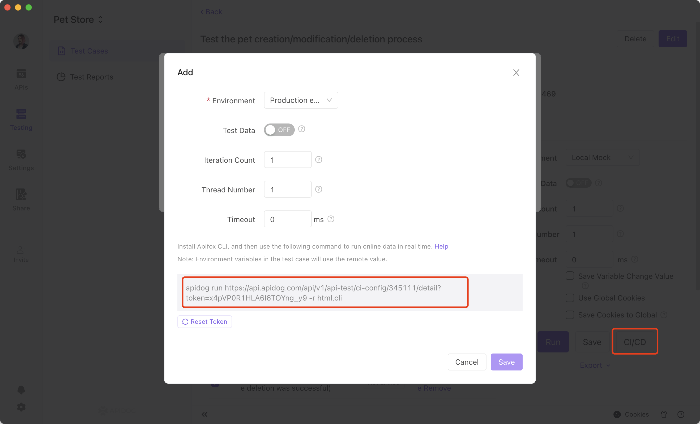

# CI / CD

We support exporting test cases to Apidog CLI, Postman, and JMeter format for continuous integration.

## 1. Apidog CLI

Apidog CLI is Apidog's command line tool designed for continuous integration. Apidog supports running with real-time data and exported data .

### Install Apidog Cli

You can use the command below to install Apidog CLI.

```js
npm install -g apidog-cli
```

### Running with real-time data

Go to the test case page, click on continuous integration, copy the generated command, and run it in command line.

```js
apidog run http://xxx/api/v1/api-test/ci-config/xxxx/detail?token=xxxx -r html,cli
```

### Running with exported data

Export to Apidog CLI format in Apidog test case page.


Run the following command:

```js
apidog run examples/sample.apidog-cli.json -r cli,html
```

### Test Report

The test report will be saved to the `apidog-reports` under the current directory.

View documentation for Apidog CLI here.

## 2. JMeter

Exporting to JMeter format is usually used for performance tests, but you can also use it for continuous integration. View performance test and continuous integration for Jmeter + Jenkins here.

:::tip Please be aware that:

JMeter does not support JS scripts. Therefore, exporting to JMeter format from Apidog does not include preprocessor and postprocessor scripts.

:::