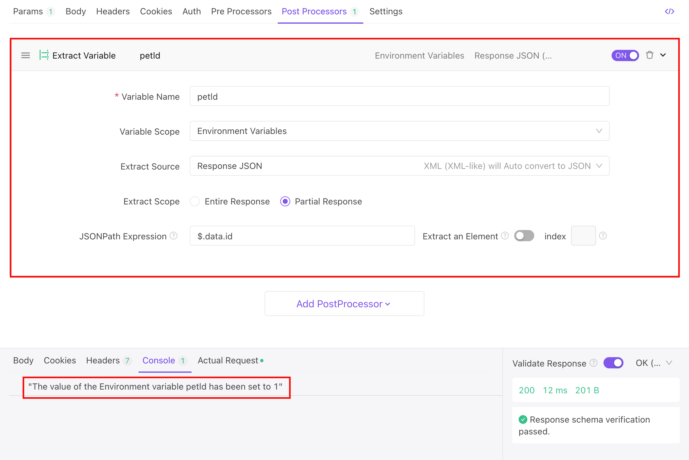
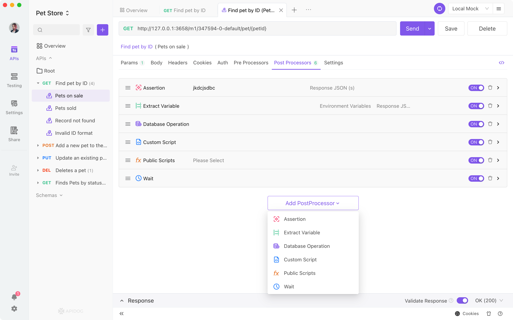
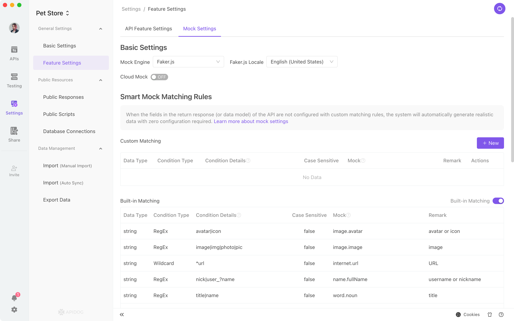

# Introduction

> Apidog is an integrated collaboration platform for API documentation, API debugging, API mocking, and API automated testing that combines `Postman + Swagger + Mock + JMeter` to tackle the data synchronization problem among different systems using a set of systems and a set of data. API debugging, API data mocking, and API automated testing can be directly used without redefining as long as the API documentation is well defined. After debugging, using the same tool for API documentation and API development can help confirm that everything follows the API documentation definition strictly. Apidog makes it effective, timely, and precise!

## Current State of API management

### Common Solutions

1. Managing API documentation with Swagger
2. Debugging API with Postman
3. Mock API data using tools like Mock.js
4. Using JMeter for API Automated Testing

### Known Problems

Maintaining data consistency between different tools is hugely challenging and inefficient. It's not just about the workload. The more significant issue is that data inconsistency across other platforms leads to ineffective collaboration and frequent difficulties, making developers' lives difficult. Commonly known problems:

1. When debugging, the developer must define the API again in Postman after defining the documentation in Swagger.
2. When Front-end developers mock data, they must redefine it with Mock.js and write the mock rule manually.
3. QA engineers must redefine it in JMeter.
4. After the Front-end developer and back-end developer have finished developing using data from Mock.js and the swagger API documentation, respectively, the Front-end and Back-end developer have completed development and debugging, they may realize that:

   - The API was changed during development, and only Swagger gets modified, but Mock.js was not updated in time.
   - It can be challenging to identify issues, such as that API data types are inconsistent with API documentation in back-end development.

5. Similarly, the test cases written in JMeter may also find various inconsistencies when they are running.
6. Various inconsistencies will worsen over time.

## Apidog Solutions

### How to resolve the above problems

#### Apidog

`Apidog = Postman + Swagger + Mock + JMeter`

Apidog is an integrated collaboration platform for API documentation, API debugging, API mocking, and API automated testing that combines `Postman + Swagger + Mock + JMeter` to tackle the data synchronization problem among different systems using a set of systems and a set of data. API debugging, API data mocking, and API automated testing can be directly used without redefining as long as the API documentation is well defined. After debugging, using the same tool for API documentation and API development can help confirm that everything follows the API documentation definition strictly. Apidog makes it effective, timely, and precise!

#### Apidog Features

1. **API design**: Apidog API documents adhere to the [OpenApi]('/') 3.0 (previously Swagger) and [JSON Schema]('/') specification while providing a convenient visual document management capability, which means zero learning curve for developers. It also supports the online sharing of API documents.
2. **Data model**: It supports reusable data structure when defining `API return data structure` and `request parameter data structure` (JSON and XML mode only). It supports direct nested model references, direct JSON/XML smart import, and supports advanced combination patterns such as oneOf, allOf, etc.
3. **API debugging**: In addition to having all the capabilities that Postman has, such as Environment variable, Pre/Post scripts, Cookie/Session global sharing, etc., Apidog is also more effective and practical than Postman. After running an API, click the `Save APICase` button to create the `APICase`. From there, you can run the API without entering the parameters again. Custom scripts are 100% compatible with Postman syntax and support running code in javascript, java, python, PHP, js, BeanShell, go, shell, ruby, lua, and other languages.
4. **API Cases**: An API typically has numerous use cases, such as the parameter's use case being correct, incorrect, empty, or the parameter state being different, etc. It is highly efficient to use API use cases to debug the API because it will trigger the use cases to run automatically and check that the data is accurate.
5. **API data mocking**: Apidog includes an integrated [Mock.js]('/') rule engine that makes it very simple to mock out various types of data. Developers can define mock rules while creating the data structure. It supports adding "expectation" to return multiple mock data based on request parameters. The most crucial feature of Apidog is its ability to simulate realistic data with `no configuration`; the relevant section has more information.
6. **Database operation**: Apidog supports reading database data and using it as an API request parameter. Apidog supports reading database data to verify (assert) whether the API request is successful.
7. **API automated testing**: Apidog supports API collection testing, which allows developers to quickly create test collections by selecting API (or API use cases). More features of Automated API Testing are still under development. Stay tuned! The objective is to have all of JMeter's features while improving the developer experience.
8. **Code generation**: The system automatically creates the `API request code`, `Front-end code`, and `Back-end` code by the API and data model specifications.
9. **Team collaboration**: Apidog is designed for team collaboration. It synchronizes real-time updates on API cloud and supports `team/project/member permission` management. Apidog would meet the needs of different businesses.

### Apidog not only enables the data flow between the front-end and the back-end, but also offers so much more

To increase development efficiency, [Apidog]('/help') has enabled data to flow between the front-end and the back-end and also made many innovations.

1. **API use case management**:

   An API typically has numerous use cases, such as `the parameter's use case being correct`, `incorrect`, `empty` or `the parameter state being different, etc. It is very efficient` to define these use cases with other states when defining the API and run them directly when debugging the API.

2. **Data Model Definition and Reference**:

   The data model can be defined independently, referenced directly when the API is defined, and referenced to each other. The same data structure can be used in multiple places by defining it once: when modifying it, the developer only needs to change it in one place, and all the instances can be updated in real-time to avoid any inconsistency.

3. **Automated API testing for data structure**:

   When using Apidog to debug the API, the system will automatically check whether the returned data structure is correct according to the definition in the API documentation. This is very effective because the developer wouldn't have to check it or write script assertions manually!

   

4. **UI Assertion with Apidog**:

   Use Assertions:

   

   Check assertion result after execution:

   

5. **UI Variable Extraction with Apidog**:

   

6. **Supports database operation**:

   

7. **Mocking realistic data with zero configuration**:

   

- Comparing results from [Apidog](https://apidog.com) and other similar tools with `zero configuration`:
- The result from Apidog with `zero configuration` mimics the data in real life. Front-end developers can directly use them without manually writing mock rules.
- Apidog can efficiently generate user-friendly mock data with `zero configuration`.
- Apidog can generate mock rules based on data structure and data type in the API definition.
- Apidog has a built-in smart mock, which generates mock rules based on field name and field data type. For example, if a string field contains "image" in its name, Apidog can generate an image URL accordingly; if a string field contains "time" in its name, Apidog can generate a time string, therefore; if a string field contains "city" in its name, Apidog can generate a city name accordingly.
- Based on built-in mock rules, Apidog can automatically identify fields, such as image, avatar, username, cell phone number, URL, date, time, timestamp, email, province, city, address, and IP, to generate user-friendly dummy data.
- In addition to the built-in mock rules, users can also customize rules to meet various personalization needs. It supports string field matching using regular expressions and wildcards.

8. **Generate online API documentation**:

   

   Apidog project supports the online sharing of API documents. The shared API documents can be set to public or require password access, which is very convenient for collaboration with external teams.

   Quick trial: **\*\***

9. **Code Generation**:

   Apidog can automatically generate business logic code (such as Model, Controller, unit test code, etc.) and API request code for various languages/frameworks (such as TypeScript, Java, Go, Swift, ObjectiveC, Kotlin, Dart, C++, C#, Rust, etc.) based on the API model definition. Currently, Apidog supports automatic code generation for 130 languages and frameworks.

10. **Import/Export**:

- Supports exporting data formats such as OpenApi (Swagger), Markdown, Html, etc. Because developers can export OpenApi format data, they can use OpenApi's (Swagger) rich tooling to accomplish various API-related things.
- Support importing OpenApi (Swagger), Postman, apiDoc, HAR, RAML, RAP2, YApi, Eolinker, NEI, DOClever, ApiPost, Apizza, ShowDoc, API Blueprint, I/O Docs, WADL, Google Discovery and other data formats, which is very convenient for project migration.
- Support automated import of OpenApi (Swagger), apiDoc, Apidog format data.

### Product Roadmap

1. Supports API performance testing (similar to JMeter).
2. Platformization of the plug-in. Developers can build their plug-ins for Apidog.
3. Supports developers using API to access features in Apidog.
4. Support more API protocols, such as GraphQL, gRPC, websocket, etc.
5. Supports offline usage. Projects can be set to enable online synchronization for team collaboration or local storage only for standalone offline use.

### More screenshots for Apidog features

   

   

   

   

   

   

   

   

   

   

   

   

   

   

   

   

   

### Downloading Apidog

Please visit the official website of Apidog to download the app. **https://apidog.com**
