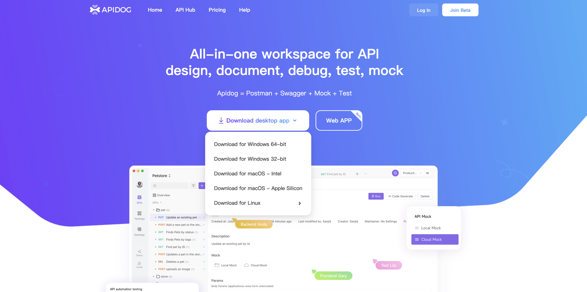
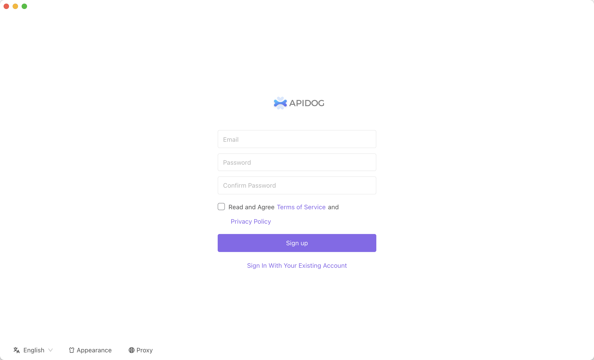
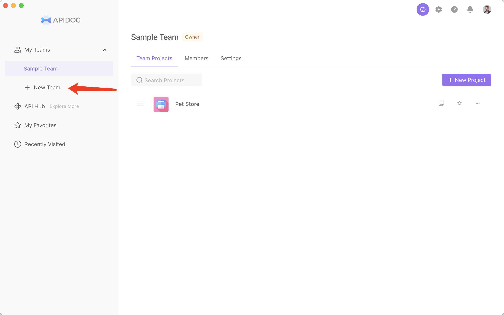
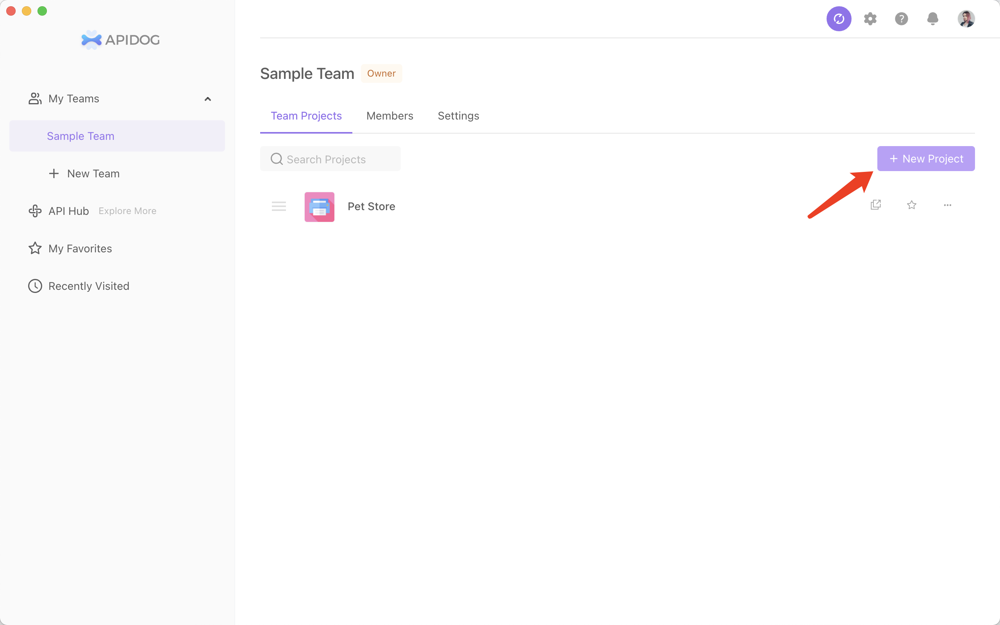
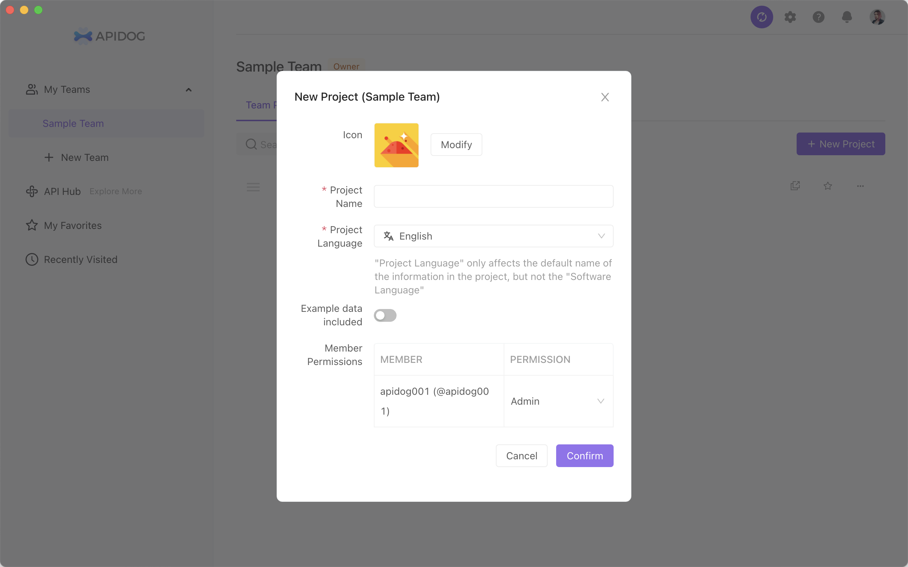
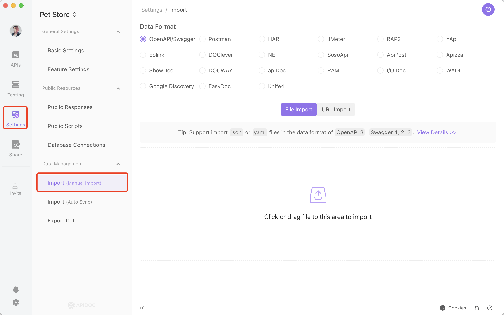
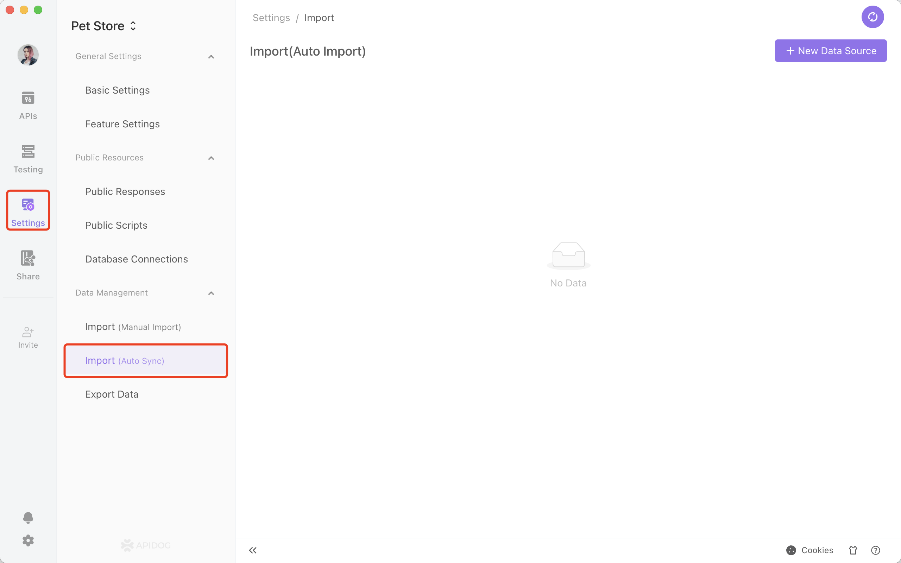
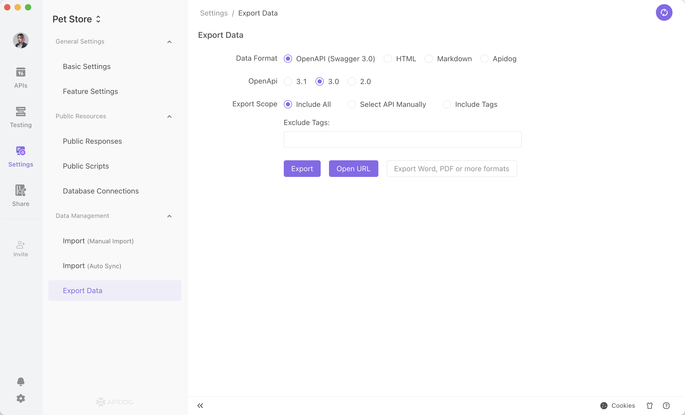
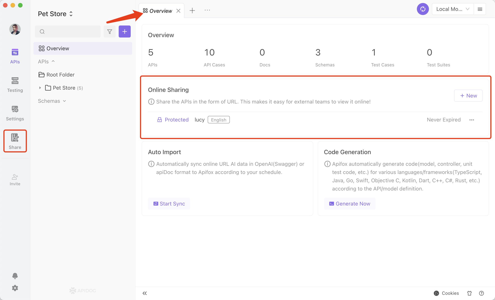
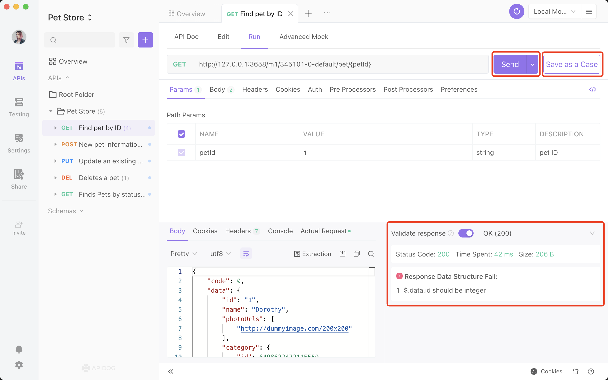

# Software Introduction

### 1. Download

Click here to download Apidog. We support Windows (64-bit), Windows (32-bit), macOS (Intel chip), macOS (M1 chip), Linux (.Applmage), and Linux (.tar.gz).

You can also use Apidog web app. However, we advise using the desktop app if you need to import any documents.

### 2. Installing

Follow the instructions in the installation package to install Apidog.

### 3. Register User

You can account register by email.

### 4. Creating a team workspace

Once logged in, you will see the team collaboration page. We provide a sample team project in Apidog, and you can use it as a reference.

You can create a team workspace, as shown in the screenshot.

You can also invite team members to join an existing team workspace. Please click the bell icon on the top right to accept invites.

For team management, read more here.

### 5. Creating project

Click Create Project to create a new project, as shown in the screenshot.

### 6. Working on a project

### 7. Import

​ For details, go to the import data page.

### 8. Export

For details, go to the export data page.

### 9. API overview page

### 10. API design page

### 11. API execution page

