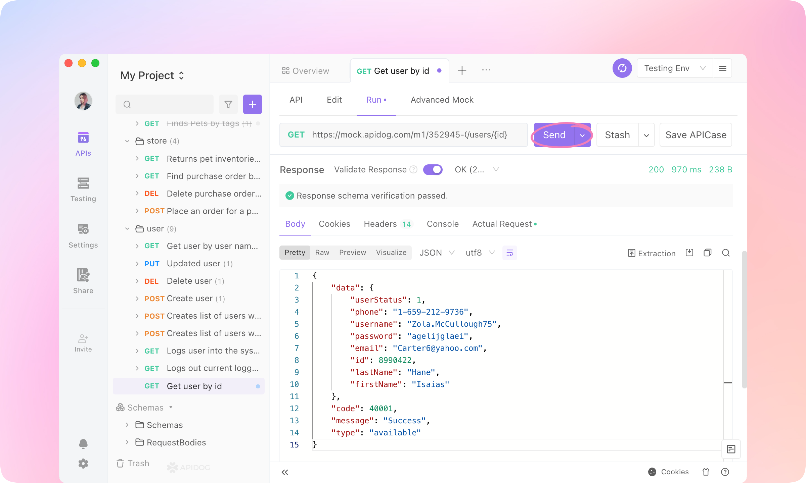
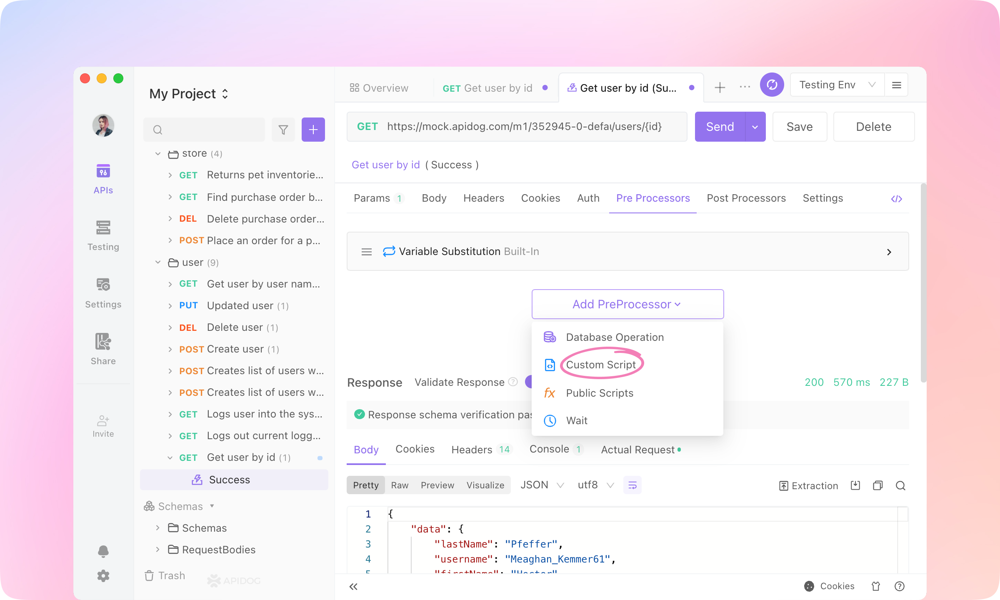
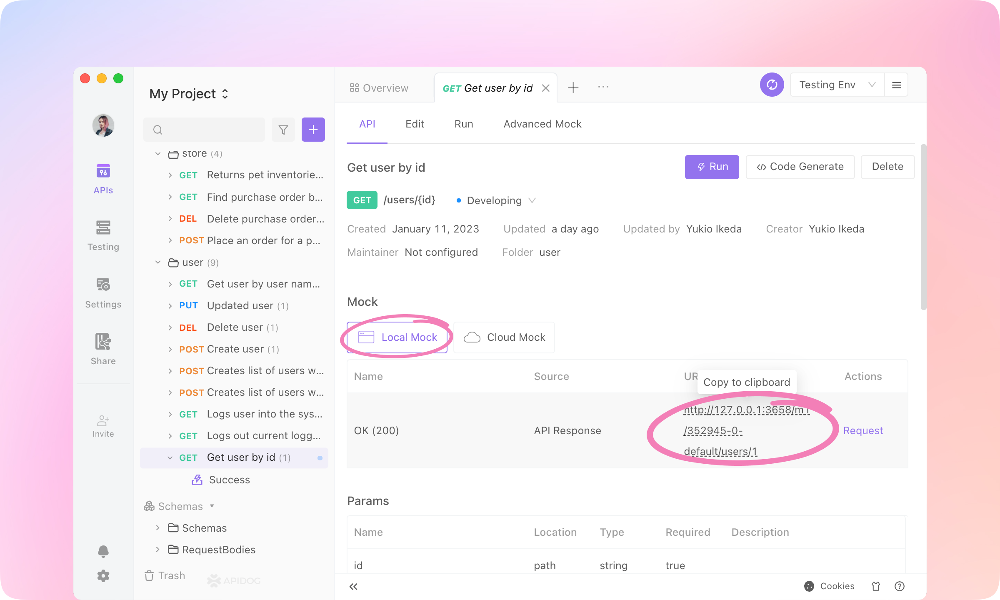
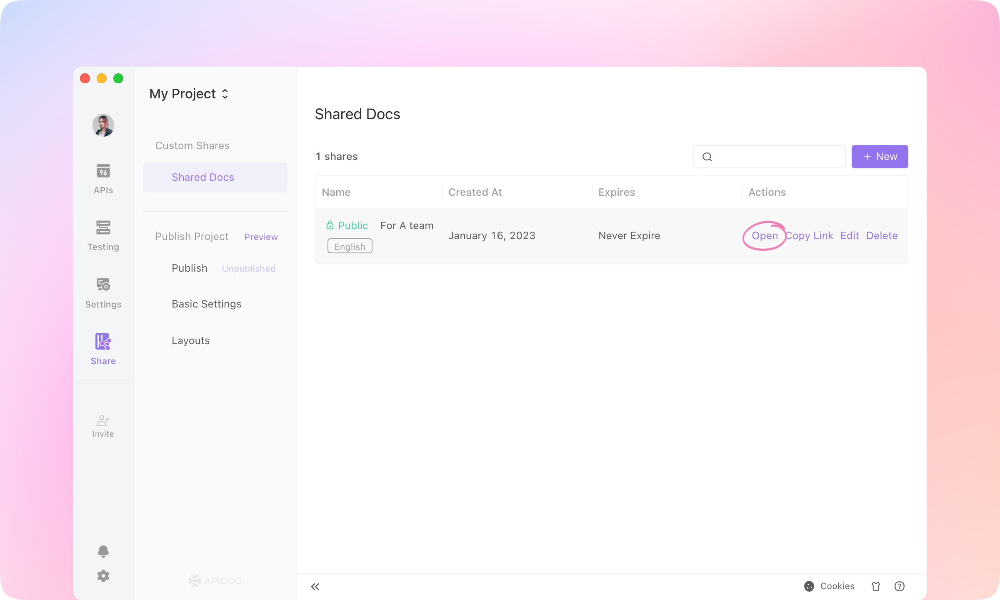

# Walk through Apidog

I'm Yukio Ikeda, product manager of Apidog. In this article, I will take you on a tour of Apidog and introduce you to its core features.
It will take about 30 minutes.

## Why Apidog

We have observed that development teams often utilize a variety of tools, such as Postman, Swagger, Stoplight, and Jmeter, to design, manage, and test APIs during the development process. However, the absence of data synchronization and collaboration between these tools can significantly hinder efficiency.

A better solution is for the entire development team to work within a single API tool. As long as the API documentation is defined, back-end developers can easily implement and self-test the API, front-end developers can easily call the API and use mock data, and test engineers can directly test the API and easily generate test cases. This greatly improves the efficiency of team collaboration.

That is why we created the Apidog product. It is a comprehensive tool for API design, development, testing, management, documentation, and mocking, specifically designed for team collaboration.

## What is Apidog

Apidog is an all-in-one toolkit for API development. The whole team can work on it together to produce APIs efficiently and conveniently. Each role in the team can use it to solve their own problems.


Apidog follows the API-first approach, which is a development approach where the API is designed and developed before the user interface. This approach has several benefits, such as:

1. Apidog allows teams to work in parallel and establish a contract between services, allowing them to work on multiple APIs simultaneously and improving development speed.
2. Automation can be achieved by using tools that import API definition files, reducing the time needed to develop and launch an API.
3. It ensures a good developer experience, with well-designed and well-documented APIs, making it easy for developers to use and reuse code, onboard new developers, and reduce the learning curve.
4. By solving most of the problems before any code is written, it can also prevent issues when integrating APIs with applications.

Apidog can help you achieve all these benefits above. 

## API Designers: Specify APIs

API designers can use Apidog to specify APIs visually or import from OpenAPI specifications.

### Import from OpenAPI specifications

If your API has been specified in OpenAPI or any other format, you can import it into Apidog so that it can be easily debugged, tested, or mocked.

1. Click `Import` in an Apidog project.


2. Switch to `URL Import`, paste the following URL and click `Submit`.

```
https://petstore.swagger.io/v2/swagger.json
```


You can also select a JSON or YAML file to import. Other API specifications formats are also supported, such as Apidog, HAR, etc.

3. Click `Confirm` to import.


4. Now you can run or test the API in Apidog. 


:::tip
Learn more about importing data [here](https://help.apidog.com/import/import-data).
:::

### Specify a new API

API designers can use Apidog to specify APIs in an intuitive interface.

1. Start a new tab and click `New API` to create an endpoint.


2. Now we're going to specify an API for querying user information by id. So you can enter these fields into the API.
   - API Path
     - `/users/{id}`
   - Name
     - `Get user by id`


3. This API has no query params or body params. You'll see 'id' recognized as a path param. Now the `Request` part is finished.
3. Roll to the `Responses` part. In the 'OK(200)' response, change the field type of the root node to 'Refs Model - Schemas - ApiResponse'.


5. Now this API has a general JSON structure like the following. Each API has a different 'data' field, so add a child node to the root node and name it 'data'.


6. Change the field type of the 'data' node to 'Refs Model' - 'Schemas' - 'User'.


7. Now the response structure is specified well. If you need to edit the 'data' structure, you can dereference the schema or dereference a field to edit.


:::tip
Learn more about Data Schema [here](https://help.apidog.com/api-manage/data-schema).
:::

8. Roll to the `Response Examples` part. Click `Add Example`.


9. Name the example 'Success'. Now it's the magical part: click `Generate Automatically`, and the response data will be generated according to the response structure. Click `OK` to add the example.


10. Click `Save` to finish the API specification. You'll get a well-designed API.


## Back-end Developers: API Developing & Debugging

Different teams adopt different development approaches. Some teams adopt API-first, and some teams adopt code-first. Regardless of which method your team uses, back-end developers can use Apidog to assist in the development and debugging of the API. 

### Generate Code

1. While APIs are specified, server stubs and client SDKs can be generated easily. Just click `Generate Code` on the API page and select `Generate Server Stubs & Client SDKs`.


2. Using the OpenAPI Generator engine, server stubs and client SDKs in tens of languages can be generated.


:::tip
Learn more about Code Generation [here](https://help.apidog.com/import/code-generation#code-generation-for-api-documentations).
:::

### Run the API

After API development is completed, the back-end often needs to debug whether the API can give the correct output under different input parameters. Using Apidog makes it easy to debug each API and ensure that they are running normally.

1. In the API page we just created, click the `Run` button to enter the `Run` tab.


2. Enter '1' to the 'id' param. In the request URL to be sent, {id} will be replaced by the value '1'.


3. Click the `Manage Environments` button at the top right.


4. Switch to 'Test Env', and paste the following URL into the 'Default Server' service. Then save the environment.

```
https://mock.apidog.com/m1/352945-0-default
```

:::tip
Learn more about Environment Management [here](https://help.apidog.com/api-manage/environment).
:::


5. Select the 'Testing Env' so that all the requests will be sent with the base URL just configured in the front.


6. Click `Send` to send the request. The response of the API will be displayed below.



### Debugging

After the API is developed, the back-end needs to test whether it can return the expected data and whether the API has implemented the correct business logic.

1. Set the value of the path param to '2', and `Send` the request.


2. You'll see an alert '🚫Response data differs from API specification: $.data.id should be integer'. That is because the $.data.id is specified as an integer, but the $.data.id in the actual response is a string.


3. Apidog automatically verifies whether the API definition and actual response are consistent. Issues such as incorrect data types, undefined enumerated values, missing required fields, and so on will be automatically detected. The back-end can easily discover problems in the response data.
4. Click `Save APICase` to save the request. The requests will be saved as children of the API and can be referenced in the testing module.


### Use Variables

In Apidog, variables are used to store values that can be reused across requests.

Environment variables are specific to an environment, meaning that they are only accessible when a particular environment is selected. Global variables, on the other hand, are accessible across all environments.

You can define environment variables in the "Manage Environments" section of Apidog, and reference them in your requests using double curly braces notation, for example {{variableName}}.

Here is an example.

1. Fill the path param 'id' with {{Userid}}.


2. Click Environment Management. Add a new variable named `Userid`, and fill the `Current Value` with '1'. Save the Variable.


3. Send the request. Click `Response` - `Actual Request` to see the request URL, and you'll find the {{Userid}} is replaced by the `current value`.


:::tip
Learn more about Variables [here](https://help.apidog.com/api-manage/variables).
:::

### Pre Processors

In Apidog, Pre Processors are operations that are executed before a request is sent. They allow you to manipulate the request and environment variables before the request is sent.

Pre Processors can be used to:

- Set or modify variables that are used in the request
- Perform data validation or data transformation
- Add or modify headers
- Log information or debug data
- Make other requests and store the response data in variables
- Modify the request URL

These operations can be written in JavaScript, and you can use the Postman SDK to access the request and response objects, as well as the environment and global variables. Once a script is added, it will execute every time the request is sent.

Here is an example to modify the request param value in Pre Processors.

1. Click the `Pre Processors` tab, and click the `Add PreProcessor` button. Add a `Custom Script`.



2. Paste the following script into the `Custom Script` area.

```
let Userid = parseInt(pm.environment.get("Userid"));
Userid = Userid + 1;
console.log(Userid);
pm.environment.set("Userid", Userid);
```


3. Drag the `Custom Script` before the `Variable Substitution` operation. Send the request.


4. After sending, you'll see the value of {{Userid}} became 2. And if you send the request many times, the {{Userid}} will plus one each time sending.


5. Public Script, Database Operation, and Wait can also be added to Pre Processors.


:::tip
Learn more about Scripts [here](https://help.apidog.com/category/using-scripts).
:::

## Front-end Developers: API Mocking

API mocking is a simulated version of an API that is used for testing and development purposes. It allows developers to test their applications or services without relying on a live API, and can be configured to return specific responses to incoming requests.

Based on the specified API, Apidog can generate mock data automatically without any configuration. That's very convenient for front-end developers.

1. Switch to the `API` tab and click `Local Mock`. Click the `URL & Params` of 'OK(200)' to copy to the clipboard.



2. Paste the URL to a browser. And you'll see a generated JSON. The data is **dynamic**; each time you reload the page, the data will refresh. 

   Especially you'll find the data generated are reasonable according to the name of the node, just like 'email' or 'lastName'. This is the powerful `Smart Mock` feature of Apidog.


3. Go to the `Edit` tab and `Dereference` the 'ApiResponse' Schema in the `Response` Part.


4. Type the `Mock` value into the nodes, and `Save` the API.
   - code
     - `200`
   - type
     - `JSON`
   - message
     - `Success`


5. Reload the page in the browser, and you'll find the JSON data refreshed, and the 'code', 'type', and 'message' fields are generated according to your settings. Now the front-end developer can use the URL to get data in the client they are developing.


6. `Faker.js` is also supported in the mock settings. You can select any Faker.js grammar to generate dynamic mock data.


7. If you need the mock response to be fixed, go to `Settings` - `Feature Settings` - `Mock Settings` - `Default Mock Type`, and switch to `Response Example First`. Then Apidog mock engine will use the API response example as the mock response.


:::tip
The mocking feature in Apidog also supports cloud mocking, returning different mock responses for different request parameters, using scripts to rewrite mock responses, customizing intelligent mock matching rules, and so on. 
Learn more about Mocking [here](https://help.apidog.com/mock/intro).
:::

## QA Engineers: API Testing

Apidog's automated testing module allows QA engineers to directly generate test scenarios referring API definitions or API cases. It supports data-driven testing and easily generates dynamic test data. The visual assertion and variable extraction features make writing test cases very simple. Apidog also supports CI/CD.

### Assertions

In Apidog, test assertions can be added visually in Post Processors. It also supports adding assertion statements in custom scripts using the Postman SDK.

1. Go to `Get user by id` -  `Success`, switch to `Post Processors` and `Add PostProcessor` - `Assertion`.


2. Enter the following assertion parameters into the Assertion.
   - JSONPath Expression
     - $.code
   - Assertion
     - Equals: 200

:::tip
Learn more about JsonPath [here](https://github.com/json-path/JsonPath#readme).
:::


3. `Send` the request, and you'll see the `Assertion Result`.

   Apidog will get the value of $.code from the response JSON and compare it with the assertion. If they match, the assertion will pass.


4. `Extract Variable`, `Custom Script`, `Public Script`, `Database Operation`, and `Wait` can also be added to `Post Processors`.

   MySQL, SQL Server, Oracle, PostgreSQL, and ClickHouse Database are supported in Apidog. SQL statements can be executed, and the SELECT result can be extracted to variables. Other SQL like INSERT, DELETE, and UPDATE can also be executed.


:::tip
Learn more about Database Operation [here](https://help.apidog.com/api-manage/processor/database/).
:::

### Test Scenarios

After writing the assertions, multiple API cases can be imported into a single test case, run with one click, and generate a test report.

1. Switch to the `Testing` module. Create a `New Test Case`. 


2. Enter the case. Click `Add Step` and select `Import from API Cases`.


3. Select API cases to be imported: 'Add a new pet to the store - Success', 'Find pet by ID - Success', 'Update an existing pet - Success'. Click OK to import.


4.  Click `Run` to execute the test case. Then you'll see a test report, and the details of each request.


5. Click `More` to see what went wrong with the failed API and compare the response with the assertions to locate the problem.


:::tip
Learn more about Test Cases [here](https://help.apidog.com/test-manage/test-case).
:::

### Data-Driven Testing

If variables are used in API cases, then the value of the variables can be set using a data table or by using the `Dynamic Value` feature to automatically generate variable values.

1. Turn on the `Test Data` switch, and click `Manage Data`.


2. Add variables and datasets, then values of the variables. Importing from CSV or JSON is also supported.


3. `Save` and `Run`, and the values of the variables will be used in the iterations of the test case.


:::tip
Learn more about Test Data [here](https://help.apidog.com/test-manage/test-data).
:::

### Dynamic Values

If you need a dynamic change in parameter values for an API, you can use the "dynamic variable" feature.

1. Click `Detail` of the API case, and click the `🪄(magic wand)` button to open the `Dynamic Value` dialogue.


2. Select `Datatype` - `number`, and you'll see a preview of the dynamic value. Click `Insert` to apply the dynamic value.


3. Dynamic values will take effect in the actual sent request. You can see the actual values sent in the `Actual Request`. Each time the request is sent, the dynamic value will generate a new value.


4. Dynamic values can also be inserted into the request body in JSON or XML format and will also be processed as actual values when sent.


:::tip
Learn more about Dynamic Value [here](https://help.apidog.com/api-manage/dynamic-variables).
:::

### CI / CD

Apidog supports running via command line. After installing the Apidog CLI, you can use the command `apidog run` to get a command line test report. This command can also be used in Jenkins for implementing CI/CD. 

1. Click CI/CD in a test case.


2. Set the test parameters and click save, and you will get a command line statement. Click `Learn More` to install Apidog CLI. 


:::tip
Learn more about CI / CD [here](https://help.apidog.com/category/ci).
:::

## API Designers & API Consumers: API Documentations

After the API is designed, developed, debugged, and tested, it becomes a product that can be called by other users. Apidog can generate beautiful API documentation, making it easy for the development team to publish the API outside of the team.

1. Switch to the `Share` module, and `+New` a share.


2. Select the environment that will be effective in the API documentation. Readers of the API documentation will be able to use the environment configured here to run the API.


3. Open the shared docs in a browser.



4. The API documentation is generated and can be shared on the internet. It also can be `Try it out` on the shared website.


5. `Code Samples` feature supports generating API request code in dozens of languages, allowing API readers to directly call the API with the generated code.


6. `Code Generation` in the `Responses` also supports generating code for the structure of the response data, supporting several dozens of languages. API consumers can use the generated code in their implementation.


7. `Custom domain`, `Top Navigation`, `Catalog Style`, `Content Footer`, and more custom features are also supported in the documentation.


## Best Practice

1. In Apidog, the API designer (or Back-end developer) defines the specifications for the API.
2. The development team collaborates to review and improve the documentation, and to ensure consistency in the API use cases.
3. Using Apidog, front-end developers can begin development with automatically generated mock data, eliminating the need for manual mock rule creation.
4. Back-end developers can debug using the API use cases during development. If all API use cases pass during debugging, the API development is considered complete. If changes to the API occur during development, the API documentation is automatically updated during debugging, ensuring timely API maintenance with minimal effort.
5. After debugging, back-end developers can easily save the function as an API use case.
6. QA engineers can then test the API directly using the API use cases.
7. Once all APIs have been developed, QA engineers (or back-end developers) can use the test case and test collection function to conduct comprehensive multi-API integration testing.
8. Joint debugging between front-end and back-end development is typically seamless because both teams adhere to the API's specifications, allowing front-end developers to switch from mock data to real data.
9. Once the API development is complete, Apidog generates a beautiful API documentation, making it easy for the development team to publish the API to external teams.

The above is a summary of the core features and usage of Apidog. Apidog also has many other rich features that can help development teams efficiently develop and debug APIs.