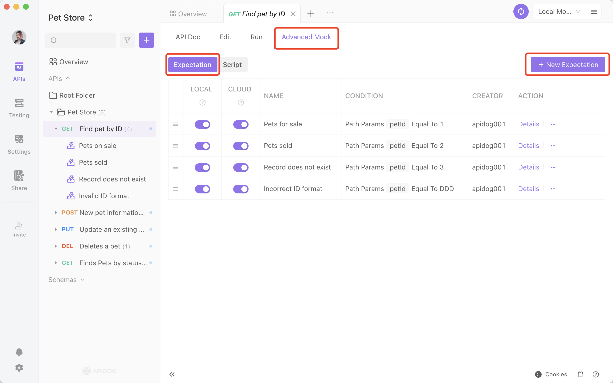
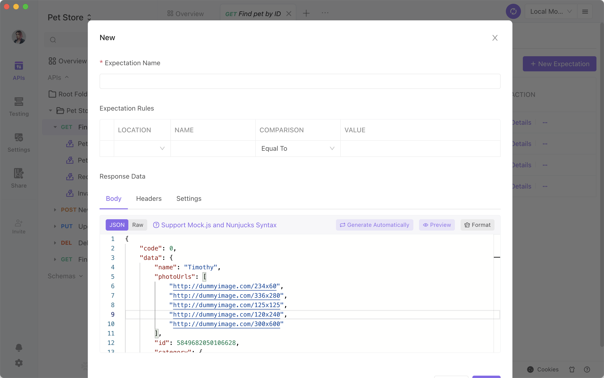
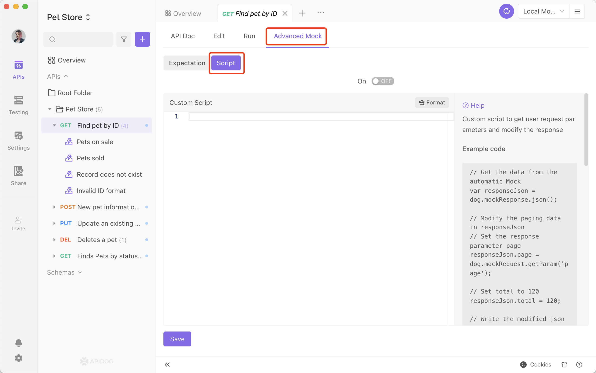

# Advanced Mock

View details for advanced mock here.

## Mock Priority

Mock rule priority: Expectations in Advanced Mock > Custom Mock Scripts.

The custom Mock script is not called if the Advanced Mock expectation is met.

## Mock Expectation


Configuration:


1. Expectation: Depending on the request parameters, different data is returned. For example, you can create two expectations:
   - Returns the sales status of available if the request parameter id is 1.
   - Returns the sales status of sold if the request parameter id is 2.
2. The expectation condition supports multiple parameters. The expectation will only be matched when all parameters are matched at the same time.
3. Expectations condition supports comparison relationships between parameter name and parameter value, including equal to, less than, greater than, exist, belong to, etc.
4. The actual request body must match the API definition if the body is chosen as the parameter location for expectation criteria. If the body request type is form-data in API definition, the parameter needs to be placed in form-data when mocking.
5. Expectation Rule: We support JSON Path matching for JSON body types.
   - We use JSON Path to match parameter names that start with the “\$”.
   - We use JSON first-level attribute names to match parameter names that do not start with “\$”.
6. Return data: We support mock.js and Nunjucks for data returned from the API request. We support returning dynamic data based on certain rules. For example:

```js
{
     "data": {
         "name": "data returned from advanced mock",
         "mockJs": [
             "@cname",
             "@integer(0,100)",
             "@image(80x90)"
         ],
         "nunjucks": [
          
          {
              "id": "{{i}}",
              "name": "@cname",
              "friends": [
                  
                  "{{item}}",
                  
             ]
          },
          
         ]
     },
     "success": true
 }
```

generated data:

```js
{
  "data": {
    "name": "data returned from advanced mock",
    "mockJs": ["Meryl Niki", 98, "http://dummyimage.com/80x90"],
    "nunjucks": [
      {
        "id": "0",
        "name": "Jeanie Lynsey",
        "friends": ["apple", "banana", "cat", "dog"]
      },
      {
        "id": "1",
        "name": "Jada Annalise",
        "friends": ["apple", "banana", "cat", "dog"]
      },
      {
        "id": "2",
        "name": "Gillian Sandy",
        "friends": ["apple", "banana", "cat", "dog"]
      }
    ]
  },
  "success": true
}
```

7. We support custom return Header, return HTTP status code, delayed response.

## Mock Custom Scripts

We support using custom scripting to get the parameters from user requests and modify the return content.

You can use custom scripts to get parameters for user requests and modify the return message.

Please be aware that custom scripts can only be used in advanced mock, not in preprocessor and postprocessor scripts.

### How to use it

1. Turn on Advanced Mock
2. Use Javascript to modify returned JSON (as shown in the screenshot below).



### Example 1

Set paged data

```js
// Get mock data from Smart Mock
var responseJson = dog.mockResponse.json();

// Modify the paged data from responseJson
// Set page as the page in request parameter
responseJson.page = parseInt(dog.mockRequest.getParam("page"));
// Set total as 120
responseJson.total = 120;

// Write the modified json into dog.mockResponse
dog.mockResponse.setBody(responseJson);
```

### Example 2

```js
var MockJs = require("mockjs");

// Get JSON from Smart Mock
var responseJson = dog.mockResponse.json();

// Modify response value based on request parameters (including query, body, and path)
if (dog.mockRequest.getParam("id") === "123") {
  responseJson.data = null;
  responseJson.code = 400104;
  responseJson.errorMessage = "data not exists";
  dog.mockResponse.setBody(responseJson);
  dog.mockResponse.setCode(404);
}

// Modify response value based on header
if (!dog.mockRequest.headers.get("token")) {
  responseJson.data = null;
  responseJson.code = 400103;
  responseJson.errorMessage = "No permission";
  dog.mockResponse.setBody(responseJson);
  dog.mockResponse.setCode(403);
}

// Modify response value based on cooked
if (dog.mockRequest.cookies.get("projectId") === "123") {
  var idList = [1, 2, 3, 4, 5, 6, 7, 8];
  dog.mockResponse.setBody({
    code: 0,
    data: idList.map(function(id) {
      return {
        id: id,
        name: MockJs.mock("@cname"),
        email: MockJs.mock("@email"),
        city: MockJs.mock("@city"),
      };
    }),
  });
}

// Set delay for response
dog.mockResponse.setDelay(500);

// Add header
dog.mockResponse.headers.add({
  key: "X-Token",
  value: "&lt;token>",
});

// Add or modify header
dog.mockResponse.headers.upsert({
  key: "X-Token",
  value: "&lt;token>",
});
```

### Request: dog.mockRequest

- dog.mockRequest.headers: Mock request headers.
- dog.mockRequest.cookies: Mock request cookies.
- dog.mockRequest.getParam(key: string): Get mock request parameters, including path, body, and query paramaeters.

### Response: dog.mockResponse

- dog.mockResponse.headers: Mock response header
- dog.mockResponse.code: HTTP code generated by the system
- dog.mockResponse.json(): JSON response generated by the system
- dog.mockResponse.setBody(body: any): Set body for mock response (we support JSON or string).
- dog.mockResponse.setCode(code: number): set HTTP code return by the mock response.
- dog.mockResponse.setDelay(duration: number): set delay (in ms) for mock response.
