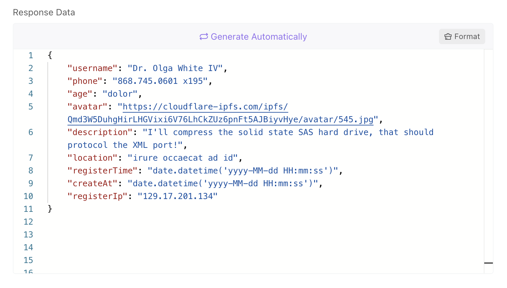
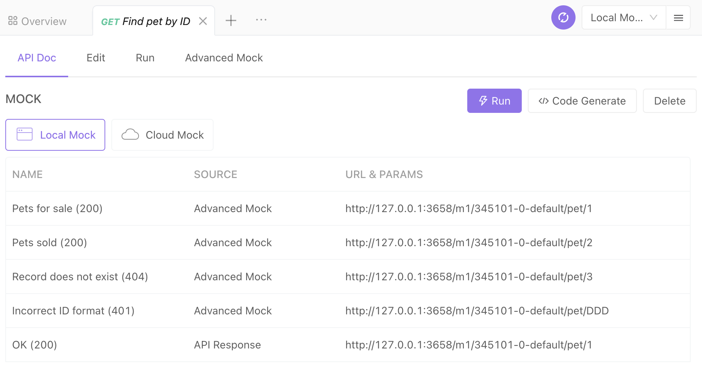

# Mock Features

Front-end development often relies on back-end API, and it is difficult to start the front-end work without the back-end API in place. Mock is designed to solve this pain point. With Mock, front-end and back-end work can happen in parallel. Before the back-end API is ready, front-end developers can utilize Mock to generate dummy data for development and debugging.

## 1. Mock Overview

Mock can automatically generate dummy data based on API or data structure definition, Mock rule configuration, and Mock expectation configuration. In addition, Mock provides flexibility to construct various APIs based on users’ needs.

In most scenarios, Apidog can generate user-friendly data by default.

How does Apidog generate very user-friendly mock data with high efficiency with zero configuration?

1. Apidog can generate mock rules based on data structure and data type in the API definition.
2. Apidog has a built-in smart mock, which generates mock rules based on field name and field data type. For example, if a string field contains “image” in its name, Apidog can generate an image url accordingly; if a string field contains “time” in its name, Apidog can generate a time string accordingly; if a string field contains “city” in its name, Apidog can generate a city name accordingly.
3. Based on built-in mock rules, Apidog can automatically identify fields, such as image, avatar, username, cell phone number, URL, date, time, timestamp, email, province, city, address, and IP, to generate user-friendly dummy data.
4. In addition to the built-in mock rules, users can also customize rules to meet various personalization needs. It supports string field matching using regular expressions and wildcards.

Below is an example of mock data generated by Apidog without any configuration:



### The difference between local and cloud mock service

When you are running Apidog desktop app, you can use the local mock service.

When you are running Apidog web app, you can use the remote mock service.

## 2. URL Mock Request URL

The request method needs to be consistent with the API definition.

If your project ID is 18600, mock API ID is 89343, path is /user/123, and request method is POST, your mock URL is:

```js
// Local Mock Address
POST http://127.0.0.1:3658/m1/18600-0-default/users/123
or
POST http://127.0.0.1:3658/m2/18600-0-default/89343

// Cloud Mock Address
POST https://mock.apidog.com/m1/18600-0-default/users/123
or
POST https://mock.apidog.com/m2/18600-0-default/89343
```

After defining the API and data structure, you can visit the URL above to visit the Mock data API without any additional manual configuration.

### Mock URL

Local Mock：

- Path: http://127.0.0.1:3658/m1/{project_id}-{version_id}-{service_id}/{api_path}
- Example: http://127.0.0.1:3658/m1/18600-0-0/users/123
- ID: http://127.0.0.1:3658/m2/{project_id}-{version_id}-{service_id}/{api_path}
- Example: http://127.0.0.1:3658/m2/18600-0-0/84924

Cloud Mock

- Path: https://mock.apidog.com/m1/{project_id}-{version_id}-{service_id}/{api_path}
- Example: https://mock.apidog.com/m1/18600-0-0/users/123
- ID: https://mock.apidog.com/m2/{project_id}-{version_id}-{service_id}/{api_path}
- Example: https://mock.apidog.com/m2/18600-0-0/84924

Additional Information

- Project ID: You can view it in Project Settings.
- Version ID: The default version ID is 0. 0 is the main version. The multi-version feature in Apidog is still under development. Please fill in 0 for version ID.
- Service ID: You will only need to specify the service ID when there are multiple services in the project. Otherwise, use default for the default service.

:::tip Please be aware that:

1. When the mock service runs locally, the URL IP address is 127.0.0.1. If other machines need to access the mock data, simply change 127.0.0.1 to intranet ip. If still not able to visit, please check whether the firewall is blocking port 3658 for mock.
2. If there are multiple APIs with the same method and path, please use one of the following methods to specify API. Otherwise, there will be path conflicts.
   1. API Path method：addtional query parameter ( ?apidogApiId={api_id}).
   2. API ID mode: No additional setup is required.
3. If the API path does not start with /, you will not be able to use API path method. Use API ID instead.
4. The mock service is turned on by default. No additional setup is required.
5. The base URL in mock service is fixed. No manual modification is allowed.

:::

#### Mock Feature in previous version

#### It is currently still backward compatible, but it will be deprecated in the future version.

- Path: http://127.0.0.1:3658/mock/{project_id}/{api_path}
- Example: http://127.0.0.1:3658/mock/18600/users/123
- ID: http://127.0.0.1:3658/mock2/{project_id}/{api_path}
- Example:[http://127.0.0.1:3658/mock2/18600/84924](http://127.0.0.1:3658/mock2/18600/84924)

#### Get API mock URL

Go to API details - View in Apidog to find the corresponding mock URLs.



## 3. Custom Mock Rule

Apidog also supports custom Mock Rule to meet your various business requirements.

### 1. Define mock rule in data structure definition

When defining data structures, you can set mock rules manually. We support Mock.js Data Placeholder Definition (DPD). Please view details of Mock.js here.

### 2. Data field advanced settings

You can also use the maximum, minimum, enumerated, pattern, and format values set in the advanced settings of the data field.

### 3.Advanced Mock

Advanced mock is the most flexible mock. You can use custom data structures (not limited by the data structure of the API). The API can return different data based on the different request parameters. View documentation for advanced mock here.

### 4. Smart Mock

When you do not provide mock rules for the fields in the return response (or data structure), the system will automatically generate realistic mock data without any manual configuration. View documentation for Smart Mock here.

## 4. Mock Rule Priority

The priority of mock rule is as followed:

1. Expectations in Advanced Mock of the API Detailed Settings (based on API parameters)
2. Mock rules in the data structure.
3. The Maximum, minimum, enumerated, pattern, and format values in the advanced settings of the data field.
4. Custom mock rules defined in project settings - smart mock.
5. Built-in mock rules in project settings - smart mock.
6. The data type field in the data structure.

## 5. Additional Info

1. By default, the system will default to mock the data structure of the first response in the API definition. If you want to mock other responses, you can get the mock URL of other responses in the Mock module of the API Detail Settings - View page.
