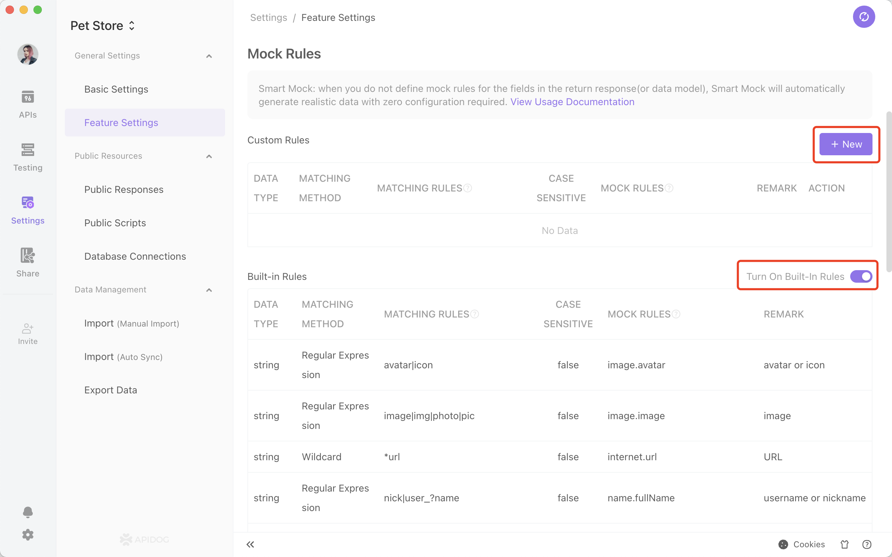

# Smart Mock

When you do not provide mock rules for the fields in the return response (or data structure), the system will automatically generate realistic mock data without any manual configuration.

## Smart Mock Setup

Go to project settings - smart mock to define custom rules and built-in rules.

1. Custom rule: users can customize rules to meet various needs. Apidog supports using regular expressions and wildcards to define custom mock rule.
2. built-in rule: The system has built-in mock rule. You can turn it on/off based on your needs.
3. Priority: Custom rules have higher priority than built-in rules. You can override built-in rules with custom rules.

