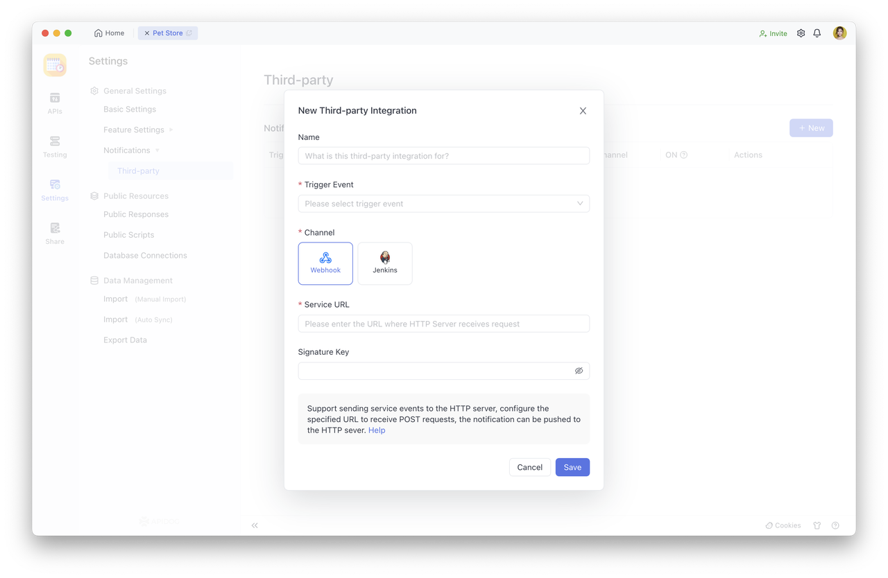
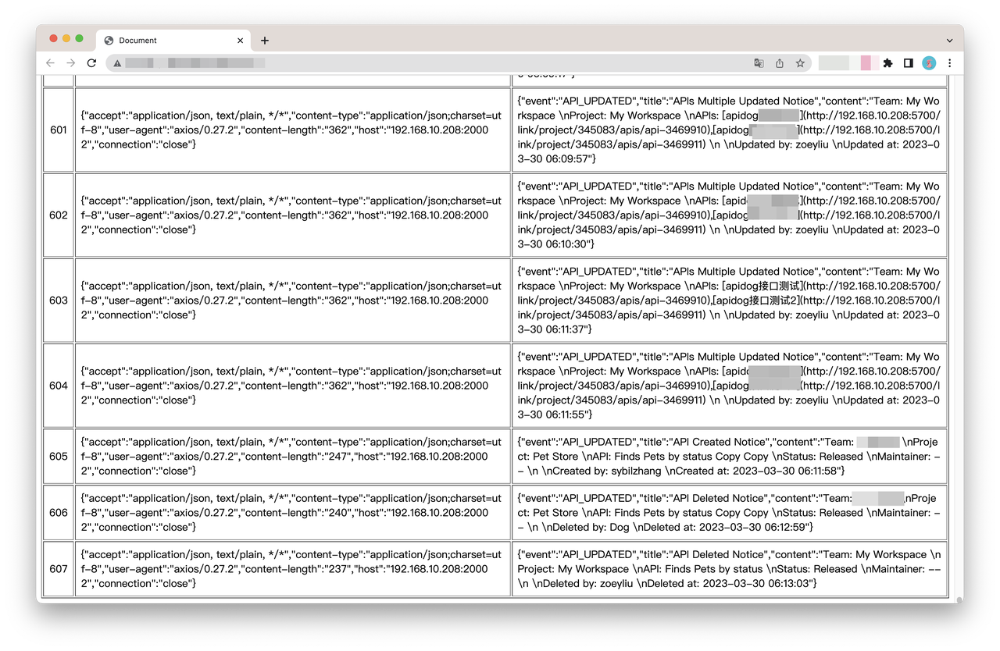
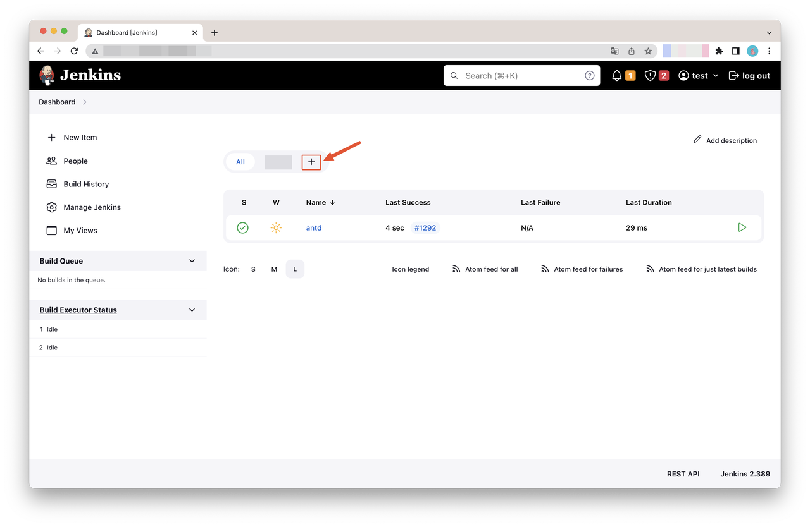
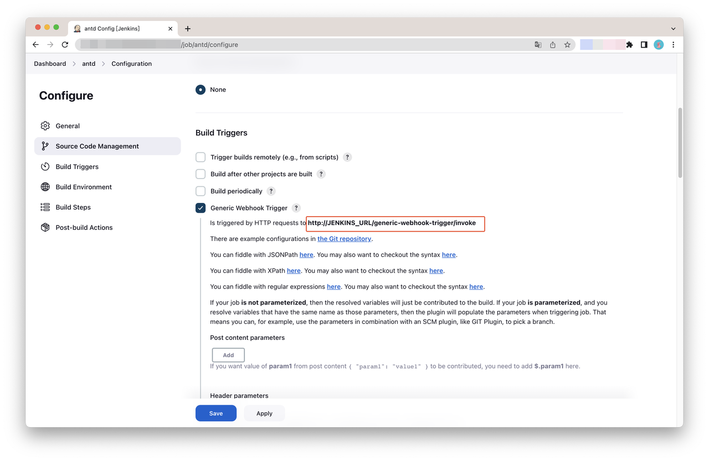
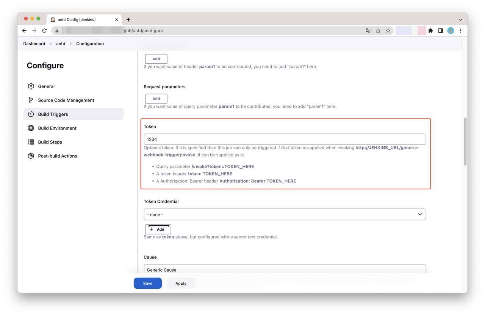
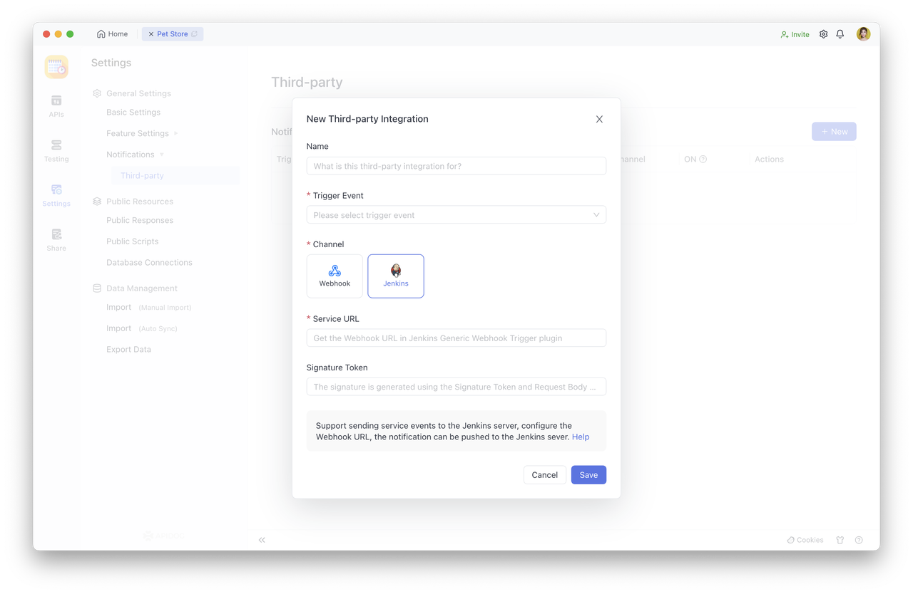
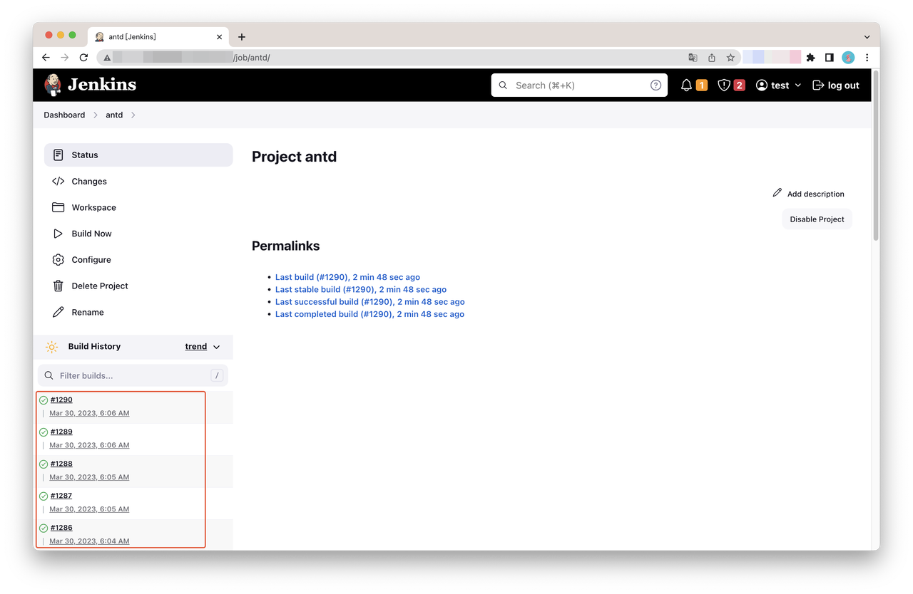

# Notification Settings

## Third-party Integration

`Third-party Integration` enables notifications to be integrated with third-party applications. Based on notification requirements, notification events can be configured. Currently, the supported notification channels include Webhook and Jenkins.

### Usage Scenarios

Integrating notifications with a third-party application sends notifications in real-time to the third-party application platform when a project member triggers the corresponding notification event, such as via.

## Configuration Instructions

Only `project managers` can configure it. 

### How to Configure Notification Events

The notification events supported by each third-party application platform vary, so the configuration items for each third-party application's notification events also differ.

### Webhook

Supports sending notification events to the HTTP Server. You can send event messages to the HTTP Server by specifying a URL address to receive POST requests.

Configuration field description:

| **Configuration Field** | Required | Description                                                  |
| ----------------------- | -------- | ------------------------------------------------------------ |
| **Notification Name**   | No       | Give a name to the third-party integrated notification to record the purpose of the notification. |
| **Trigger Event**       | Yes      | Supported eventsInterface changesData model changesDocument changesImport dataAutomation testing |
| **Server URL**          | Yes      | URL address of the HTTP Server for receiving requests        |
| **Signature Auth**      | No       | The sent content is encrypted by the [HMAC SHA1](https://en.wikipedia.org/wiki/Hash-based_message_authentication_code) encryption algorithm, using a token as the KEY to display the value in hexadecimal (requires a configured token), and contains the prefix sha1= |

#### Binding Self-hosted HTTP Server

Project administrators can use third-party integration to associate their self-hosted HTTP Server with project notification events in Apidog, to receive notifications for relevant API changes, document changes, and automation test completions in their HTTP Server.

**Creating a new notification event**

In`Settings>Third>Party Integrations`, click on Create New:

1. Fill in the notification name.
2. Select the triggering event.
3. Choose `Webhook` as the channel.
4. Paste the URL of the self-hosted HTTP Server in the `Service URL` field.
5. If the signature verification is enabled, copy and paste the key in the `Signature Key` field.

After saving, the binding is completed. When the selected event is triggered, a notification will be received in the HTTP Server:

### Jenkins

It supports sending notification events to Jenkins service. By configuring Jenkins Webhook URL, event messages can be sent to Jenkins.

Configuration field instructions:

| **Configuration Field** | **Required** | **Description**                                              |
| ----------------------- | ------------ | ------------------------------------------------------------ |
| **Notification Name**   | No           | Give a name to the third-party integration notification to record its purpose. |
| **Trigger Events**      | Yes          | API changesData model changesImport dataAutomation testingReal-time notifications will be triggered when any of the above events occur. |
| **Service URL**         | Yes          | The URL is configured in the [Generic Webhook Trigger](https://plugins.jenkins.io/generic-webhook-trigger/) plugin. |
| **Signature Auth**      | No           | Sent to the [Generic Webhook Trigger](https://plugins.jenkins.io/generic-webhook-trigger/) plugin via the Authorization Bearer header. |

#### Binding Jenkins Service

Project administrators can use third-party integration functionality to associate the Webhook URL configured in the Jenkins [Generic Webhook Trigger](https://plugins.jenkins.io/generic-webhook-trigger/) plugin with project notification events in Apidog, to trigger a build action in Jenkins automatically when events such as API changes, document changes, and automation test completions are triggered, and view messages in the build history.

1. **Webhook URL configured in Jenkins** **[Generic Webhook Trigger](https://plugins.jenkins.io/generic-webhook-trigger/)** **plugin**

Create a new view on the Jenkins Dashboard:

Click on the view in the previous step to enter `Configure`>`Build Triggers`, and select  `Generic Webhook Trigger`. Webhook URL is `"http://"+"your service address"+"/generic-webhook-trigger/invoke"`

The custom token is supported: 

2. Create a new notification event

In`Settings>Third-Party Integrations`, click on Create New:

  1. Fill in the notification name
  2. Select the triggering event
  3. Choose `Jenkins` as the channel
  4. Paste the Webhook URL configured in the [Generic Webhook Trigger](https://plugins.jenkins.io/generic-webhook-trigger/) plugin in the `Service URL` field
  5. If a custom token is used, copy and paste the `Token` into the `Signature Token `field.

After saving, the binding is completed. When the selected event is triggered, Jenkins will automatically initiate a build action and view the message in the build history:

