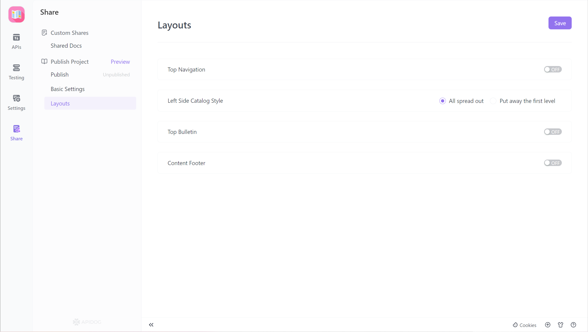
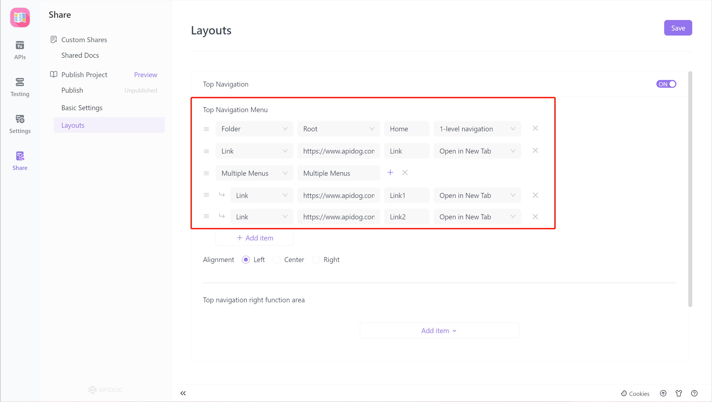
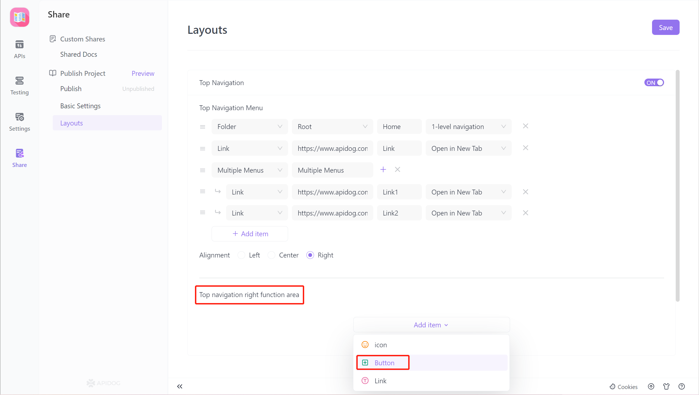
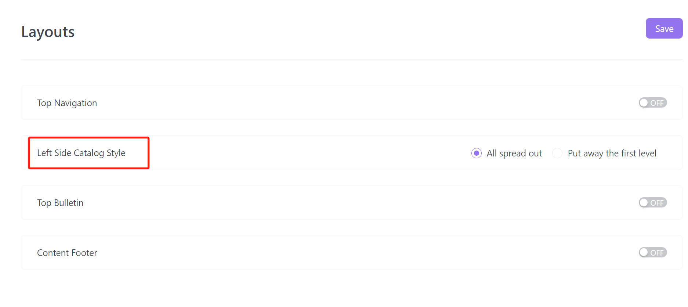
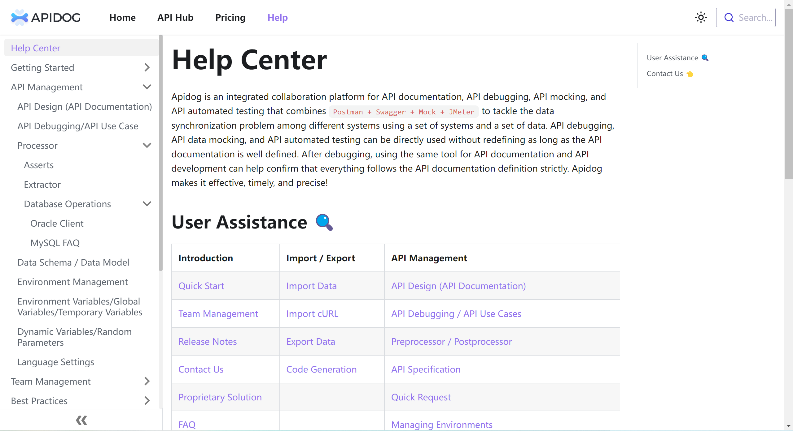
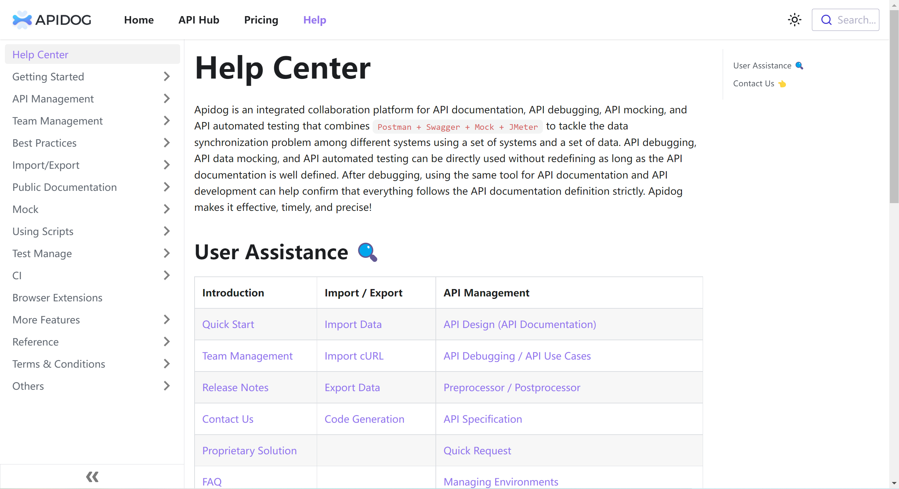
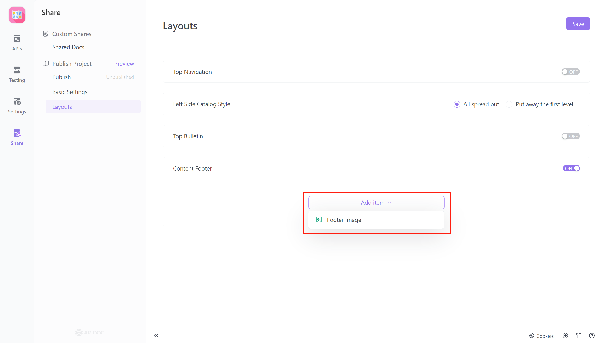

# Page Layout Settings

## Function Description

Page layout settings allow users to customize the `online document` interface, including adding navigation functions, a document bottom banner, login and registration buttons, and other convenient entry points.

Note:

More components will be supported in the future, such as the left-side directory function area component, the right-side directory function area component, and the lower-right corner floating area component.

## Module

There are currently 4 modules that support adding various components within the module. They are `Top Navigation`, `Left Side Catalog Style`, `Top Bulletin`,  and `Content Footer.`

### Document Content Bottom Banner

#### 1. Top Navigation 

Provides custom navigation menu editing and supports three types of navigation:

**Specified Interface Group:** Supports selecting all interfaces

**A Specific Interface Group Custom Link:** Supports a custom text

 **Links Multi-level Menu:** Supports defining a two-level menu

#### 2. Button Component 

The top navigation right-side function currently supports adding `button components` and will support `icon components`, ` text components`, `search box components`, and `light / dark mode switching components` in the future.

### 3. Left Side Catalog Style Module

`Top Navigation` and `Left Side Catalog Style ` are enabled, and the Left-Side Catalog Style will be disabled. To use the Left Side Catalog Style Module, the Top Navigation Module must be turned off.

Fully expanded effects:   

Collapsed primary directory effect: 

### 4. Content Footer

Currently, `Footer Image`component is supported, which can add pictures at the bottom of the document to help with business promotion, etc.

