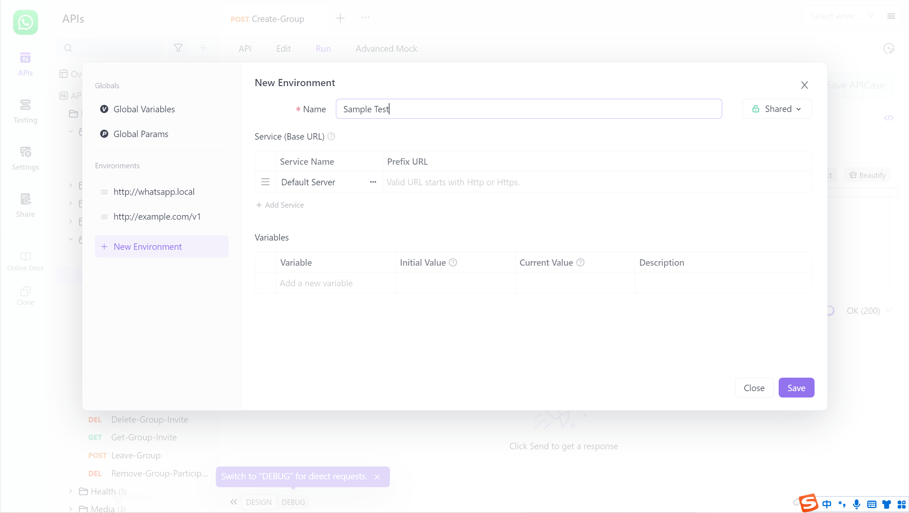

# Sharing Online

In API development, communication, and collaboration, API documentation is logically the standard, but in practice, there is the problem of passing around files in Word and PDF formats. For this reason, online documentation `online document` is advocated to improve the efficiency of communication between teams.

## Sharing Online Documents

In the software interface, `online document` for the current project can be set on the left side.


Click on "New Share," and set the information content according to your needs:

- Document Language
-  Access Password 
- Date of Sharing Online Documents 
- Sharing Scope: You can choose the entire project, select specific interfaces, or import them based on tag dimensions. 
- Operating Environment: You can select the operating environment and display the corresponding URL. After selection, the shared online interface documentation supports running and debugging. 
- The person in charge of the interface documentation, modification time, and corresponding URL can be displayed.

Share the Entire Directory

The online document supports `share the entire directory`. Select the corresponding group to open the entire directory sharing, and the group will automatically synchronize to the online document after modification. Of course, if you do not want the online document to synchronize your modifications in real time, you can choose not to enable it.


After the setting is complete, copy the link to share with team members.


## View Online Documents

During the `Online document` process, copying interface URLs, data interface fields, and return example fields are supported.


### Online Interface Documentation Supports Running and Debugging.

Prerequisite: When setting up `online sharing`, the environment needs to be set (`cloud mock` is recommended).   


Not only does online documentation support online running and debugging, but also many open documents in API Hub support it, which facilitates debugging and use, further improving development and docking efficiency.


### Online Documents Support Modifying Environment Variables

Prerequisite: When setting up`online sharing`, the environment where the interface refers to `environment variables ` need to be set.

When debugging the online document interface, there will be a scenario of modifying the environment variables referred to by the interface documentation. Now, according to the figure below, the environment variables can be modified, and then run for debugging.



## Online Documents Support Displaying Sample Code

The shared  `online interface document` supports displaying sample code, and so does API Hub. You can directly copy the current interface's code for immediate use.


## Run in Apidog Link URL Specification

### 1. Link Address

|                                            |                                                              |                                                              |
| :----------------------------------------- | :----------------------------------------------------------- | :----------------------------------------------------------- |
| **WEB Version**                            | Project Address                                              | https://apidog.com/web/project/{Project ID}              |
|                                            | Specified interface in the project-document tab              | https://apidog.com/web/project/{Project ID}/apis/api-{Interface ID} |
|                                            | Specified interface in the project-run tab                   | https://apidog.com/web/project/{Project ID}/apis/api-{Interface ID}-run |
| **Online documentation (public project) ** | Document homepage                                            | https://apidog.com/apidoc/project-{Project ID}           |
|                                            | Specified interface in the document                          | https://apidog.com/apidoc/project-{Project ID}/api-{Interface ID} |
|                                            | Specified interface in the document-automatically open the "run" module | https://apidog.com/apidoc/project-{Project ID}/api-{Interface ID}-run |

### Pass environment variables

Function: Set the user's "environment variables" automatically by passing parameters.

Usage: Add URL parameters environment[`variable name`]=`variable value`. Example:

WEB  Version Project:

- https://apidog.com/web/project/406014?environment[aaa]=xxx&environment[bbb]=yyy
- https://apidog.com/web/project/406014/apis/api-10061199-run?environment[aaa]=xxx

Online Documents:

- https://apidog.com/apidoc/project-406014?environment[aaa]=xxx&environment[bbb]=yyy
- https://apidog.com/apidoc/project-406014/apis/api-10061199-run?environment[aaa]=xxx

### Pass request parameters

Function: Set the "interface parameters" of the "run" module (only applicable to specified interface addresses and run tabs within the project).

Simple mode

Note: "Simple mode" does not support scenarios where parameter names include square brackets. In this case, please use "Advanced mode."

- Pass parameters via URL on the WEB running interface:https://apidog.com/web/project/406014/apis/api-10061199-run?query[aaa]=yyy&query[bbb]=yyy&path[aaa]=yyy&body[aaa]=yyy&header[aaa]=yyy&cookie[aaa]=yyy&environment[aaa]=yyy
- https://apidog.com/apidoc/project-406014/api-10061199-run?query[aaa]=yyy&query[bbb]=yyy&path[aaa]=yyy&body[aaa]=yyy&header[aaa]=yyy&cookie[aaa]=yyy&environment[aaa]=yyy

| Parameter Type        | Parameter  Value     | Remarks                                                      |
| :-------------------- | :------------------- | :----------------------------------------------------------- |
| Query Params          | query[xxx]=yyy       |                                                              |
| Path Params           | path[xxx]=yyy        |                                                              |
| Body Params           | body[xxx]=yyy        | Body Types include formdata or x-www-urlencoded              |
| Body Params           | body=yyy             | Other Body Types                                             |
| Header Params         | header[xxx]=yyy      |                                                              |
| Cookie Params         | cookie[xxx]=yyy      |                                                              |
| Environment Variables | environment[xxx]=yyy | It will save to the environment variables of the default environment. |

Advanced Mode

WEB run interface, Passing parameters by URL:

[https://apidog.com/web/project/406014/apis/api-10061199-run?params={ "query"%3A{ "aaa"%3A"xxx"%2C "bbb"%3A"yyy" }%2C "body"%3A{ "aaa"%3A"xxx"%2C "bbb"%3A"yyy" }%2C "cookie"%3A{ "aaa"%3A"xxx"%2C "bbb"%3A"yyy" }%2C "environment"%3A{ "aaa"%3A"xxx"%2C "bbb"%3A"yyy" } }](https://apidog.com/web/project/406014/apis/api-10061199-run?params={    "query"%3A{        "aaa"%3A"xxx"%2C        "bbb"%3A"yyy"    }%2C    "body"%3A{        "aaa"%3A"xxx"%2C        "bbb"%3A"yyy"    }%2C     "cookie"%3A{        "aaa"%3A"xxx"%2C        "bbb"%3A"yyy"    }%2C     "environment"%3A{        "aaa"%3A"xxx"%2C        "bbb"%3A"yyy"    } })

The value of `params` is obtained by encodeURIComponent on the following JSON data.

JSON

```
{

    "query": [

        ["id", "value1"], 

        ["id", "value2"], 

        ["key2", "value3"]

    ],

    "path": [

        ["key1", "value1"], 

        ["key2", "value2"]

    ],

    "body": [

        ["aaa", "value1"], 

        ["key2", "value2"]

    ],

    "header": [

        ["testHeader", "value1"], 

        ["key2", "value2"]

    ], 

    "cookie": [

        ["testCookie", "value1"], 

        ["key2", "value2"]

    ], 

    "environment": [

        ["key1", "value1"], 

        ["key2", "value2"]

    ]

}
```

| Parameters Type       | Parameters Value | Remarks                                                      |
| :-------------------- | :--------------- | :----------------------------------------------------------- |
| Query Params          | query            |                                                              |
| Path Params           | path             |                                                              |
| Body Params           | body             | If the body type is formdata or x-www-urlencoded, the value of body is json; otherwise the value of body is string |
| Header Params         | header           |                                                              |
| Cookie Params         | cookie           |                                                              |
| Environment Variables | environment      | It will save to the environment variables of the default environment. |