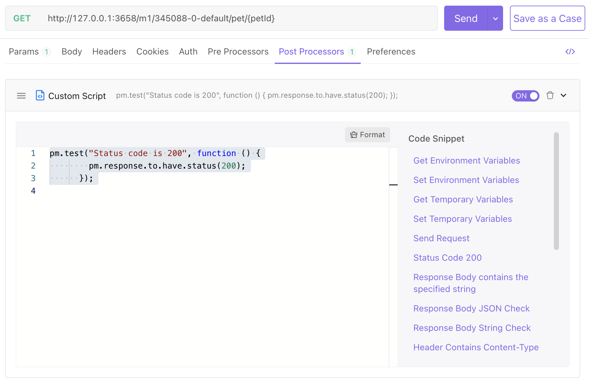

# Intro to Scripts

Apidog contains a Javascript-based scripting engine. You can use scripts (JavaScript code snippets) to add dynamic behavior to API requests or collection tests.

What can be achieved with scripts:

1. Test (assert) the correctness of the results returned by the request (postprocessor script).
2. Modify API request parameters dynamically, such as adding API signature parameters, etc (preprocessor script).
3. Pass data between API requests (using scripts to manipulate variables).
4. Directly call programs written in other languages. We support java(.jar), python, PHP, JS, BeanShell, go, shell, Ruby, Lua, etc.

:::tip Please be aware that:

Apidog script syntax is 100% compatible with Postman script syntax. Postman scripts can be seamlessly migrated to Apidog.
:::

## Usage

Scripts can be added in the following two stages:
    
1. Use preprocessor scripts before sending the request to the server.
2. Use the postprocessor script (assertion) after receiving the response.



Global scripts and group scripts:

1. Support preprocessor and postprocessor in global settings (set in the project overview). These will take effect at runtime.
2. Support preprocessor and postprocessor in group settings (set in the project overview). These will take effect at runtime.

The execution order of the API request is as follows:

```js
Global preprocessor scripts -> Group preprocessor script -> API preprocessor script -> Send API request -> Return Response -> Global postprocessor script -> Group postprocessor Script -> API postprocessor script
```

## Debugging Scripts

You can write debugging scripts in preprocessor and postprocessor, and you can log output information through console.log("message"). Open the control panel to view it.
