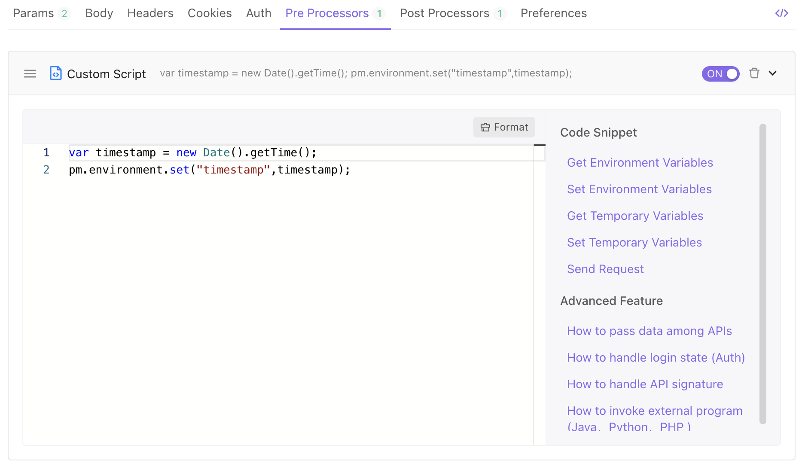
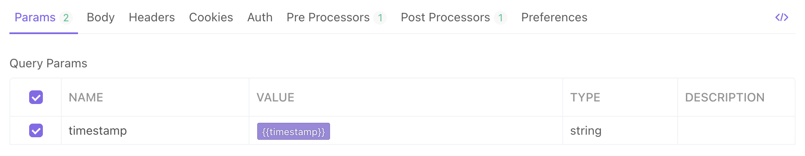

# Preprocessor Scripts

A preprocessor script is a code snippet that is executed before the request is sent. This is useful when you want to include a timestamp in the request header or send a random alphanumeric string in the URL parameters.

## Example

You can use the value returned to set the environment variable in order to include the current timestamp in the request header.

Set the value of the parameter timestamp as `{{timestamp}}`. When the request is sent, the preprocessor script will be executed, the value of the environment variable timestamp will be set to `the current timestamp`, and `{{timestamp}}` will be replaced with `the current timestamp`.

Please be aware that the corresponding environment must be selected when setting an environment variable.

The preprocessor script is written in JavaScript and has exactly the same syntax as the postprocessor script. However, there is no `pm.response` object.

## More Examples

1. View examples of using different variables, including environment variables, and global variables, temporary variables here.
2. View examples reading and modifying request information here.
3. View examples of sending API requests with scripts here.
4. View examples of Encrypt/Decrypt here.
