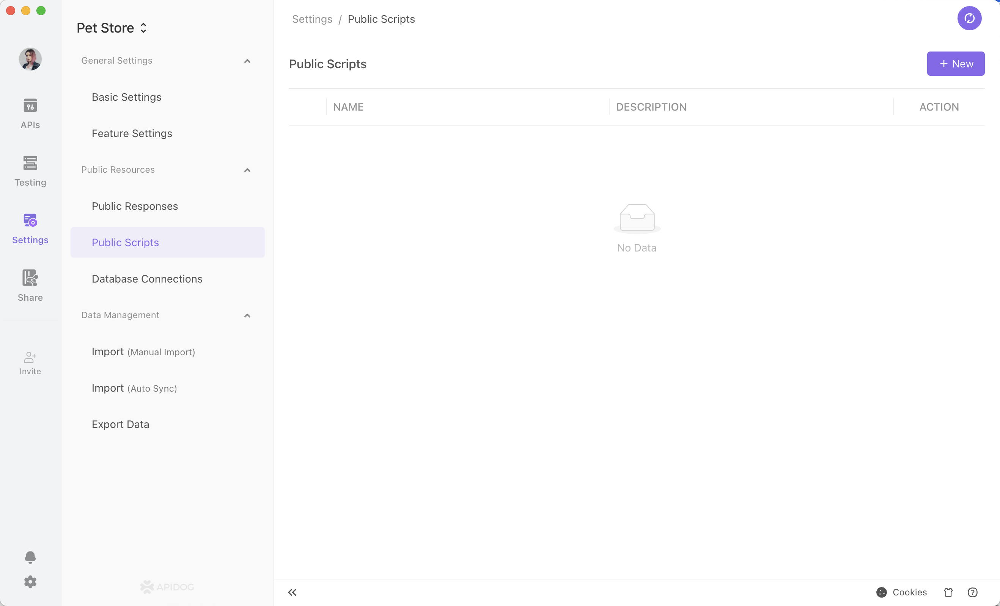
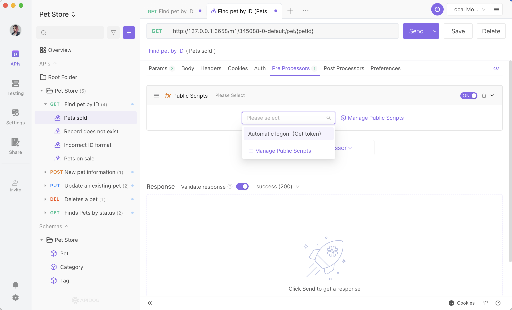

# Public Scripts

Public scripts are designed to re-use scripts and avoid repetitions of the same scripts in different places.

You can place the scripts with the same methods and classes in the public scripts and reference the script directly in your API requests.

## Usage

### Manage Public Scripts

Go to project settings -> public script to manage your public scripts.



### Reference public scripts

You can directly reference public scripts in the preprocessor and postprocessor in API Execution Page or API Use Case page.



:::tip Please be aware that:

- The public scripts are executed before all the other scripts.
- The execution of multiple public scripts occurs in the same order as their addition.

:::

## Referencing Public Scripts in Other Scripts

Scripts can call each other. For example:

- When normal scripts need to call variables or methods in public scripts, you should not use APIs of setting types such as pm.sendRequest and pm.environments.set. This will fail. We recommend writing pure functions and returning them.
- Public scripts can call each other.
- Postprocessor scripts can call preprocessor scripts.

All scripts are executed within their own scope to prevent variable conflicts between them (wrapped by closures). When local variables or local methods are declared with var, let, const, or function, other scripts cannot call those variables or methods. You must convert a variable or method to a global variable or global method if you want other scripts to use it.

Variable Example:

```js
// Declare a local variable, which cannot be used by other scripts.
var my_var = "hello"；
```

Recommend:

```js
// Declare a global variable, which can be used by other scripts.
my_var = "hello";
```

Function Example:

```js
// Declare a local function, which cannot be used by other scripts.
function my_fun(name) {
  console.log("hello" + name);
}
```

Recommend:

```js
// Declare a global function, which can be used by other scripts.
my_fun = function(name) {
  console.log("hello" + name);
};
```

:::tip Please be aware that:

- You need to make sure there are no conflicts in global variable or global method naming between scripts.
- For API use cases, you need to add public scripts in preprocessor or postprocessor scripts in order to use it.
- You need to pay attention to the order of calls when referencing scripts. Only scripts that are executed later can make calls to scripts that were executed before.

:::
