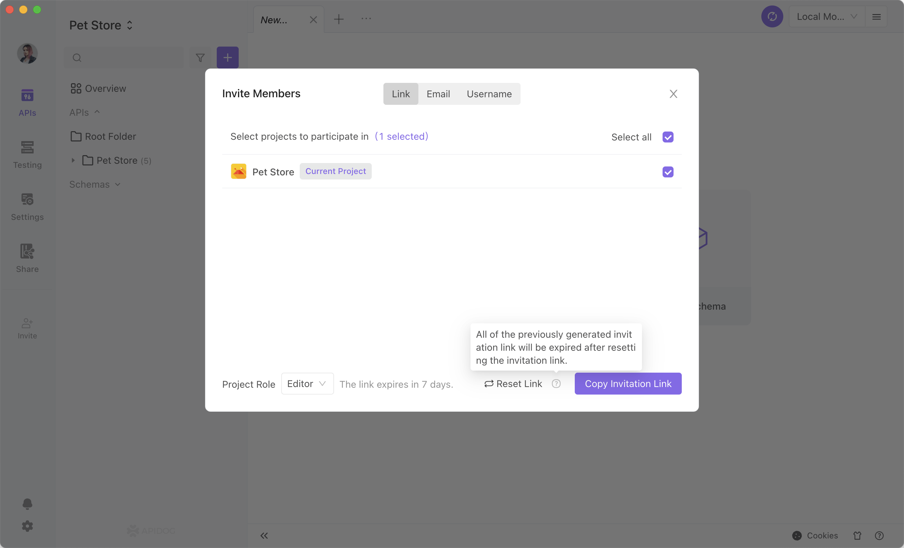

# Inviting Members

Once you are familiar with team permission and the teamwork process, you can start inviting your fellows into the team.

## How to invite

1. When a project is open, you can invite participants by selecting Invite members from the menu on the left.

2. You can also invite members by going to the team page. Go to Members/Permissions, and then click Invite Members.

## Invite Settings

You can determine which project your invitee should participate in and what role they should have within the project. View team permission for more details.

## Invitation Methods

### Inviting by Invitation Link

You can click Copy Invitation Link to provide the link to your invitee if they have not yet created an Apidog account. During the brief window that follows, they can register, join the team, and participate in the project if they so choose. There is no limit in the number of participants.

You can click the Reset link in the bottom right corner to revoke the invitation link you previously shared. After revoking, the invitation URL you previously shared will no longer work.

### Inviting by Email

You can also invite people by sending email invitations. You can invite up to 50 members at once.

### Inviting by Account

If your invitee has already resigned on Apidog, you can directly enter his account or email. You can enter one member each time.

