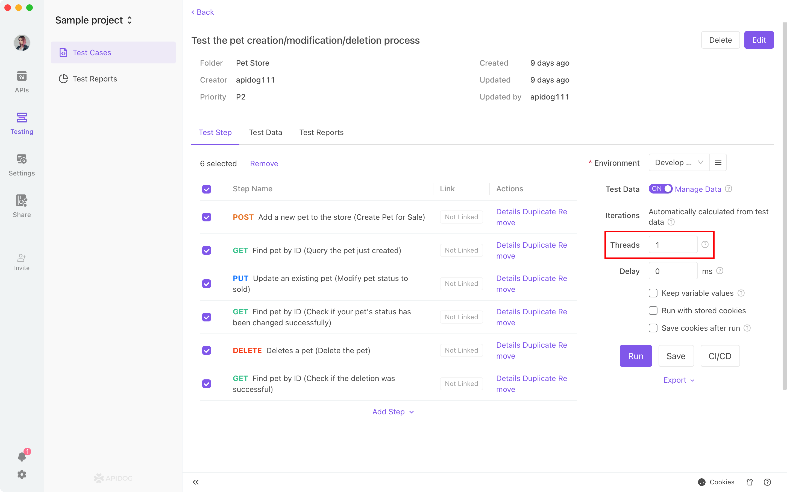

# Performance Test

There are three types of performance tests. 

## 1. Apidog in-app testing

When running `test cases`, set `the number of threads` greater than `1` to run performance testing.

`The number of threads` is the number of processes running concurrently. Each thread will run based on the selected steps in order. 
:::tip PLEASE BE AWARE THAT
This feature is in beta and is still being optimized. We recommend high concurrency testing via JMeter.

:::
## 2. Apidog CLI testing

Apidog CLI is Apidog's command line tool designed for continuous integration and stress testing. Stress testing feature is currently under development. Stay tuned!

## 3. JMeter testing 

You can export `test cases` in `JMeter` format and import into JMeter for performance testing. 
