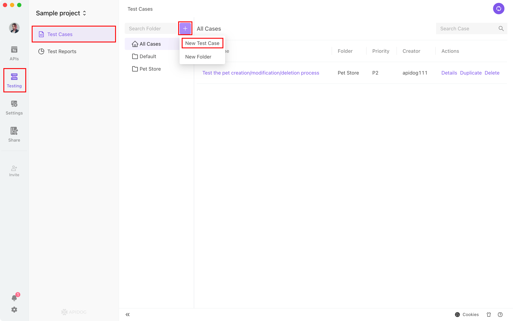
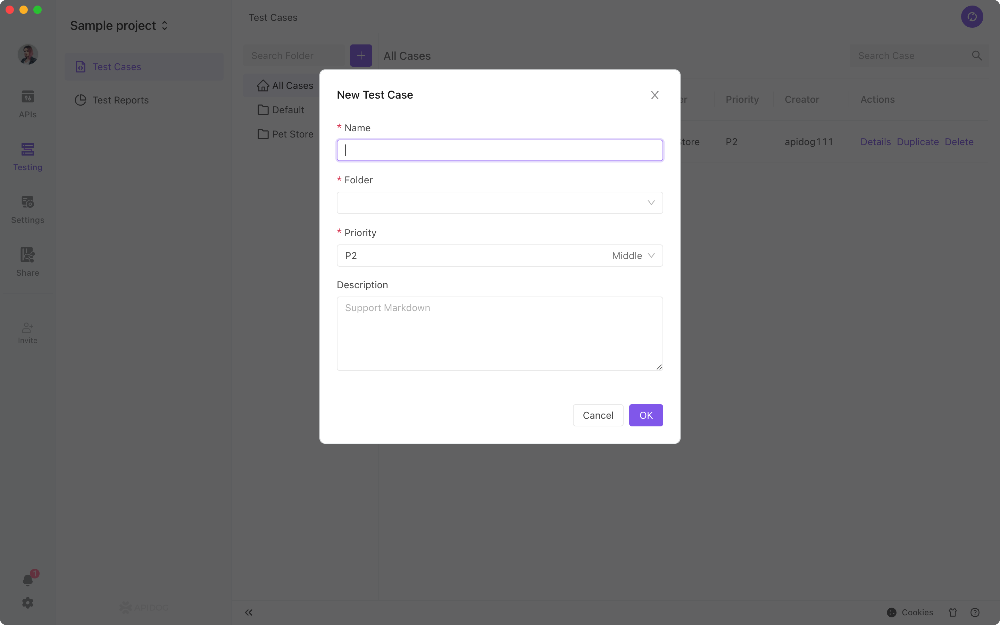
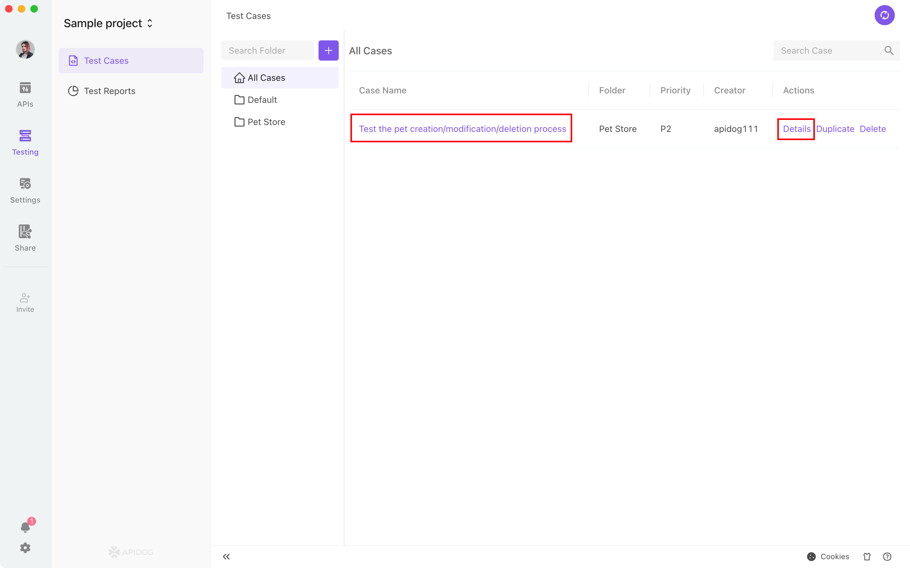
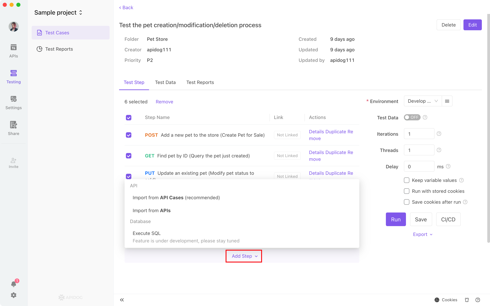
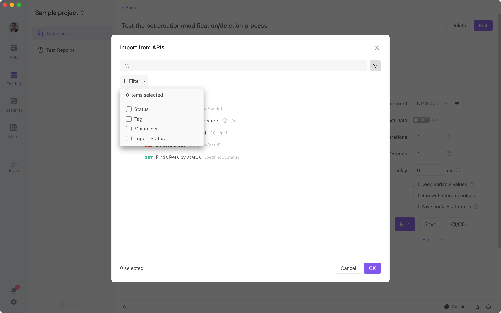
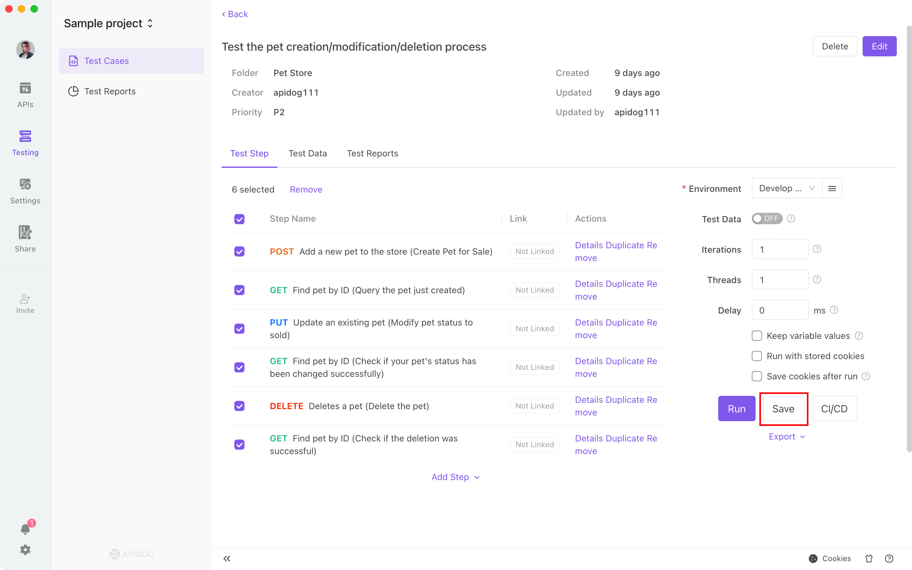
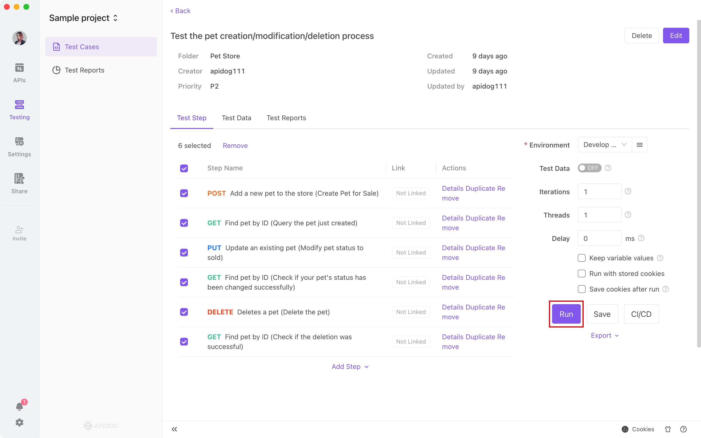
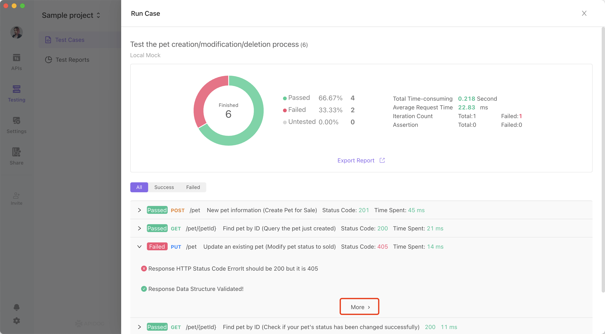
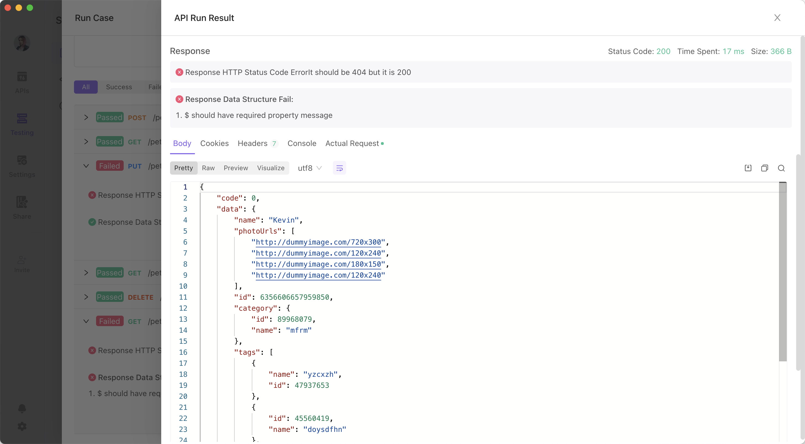
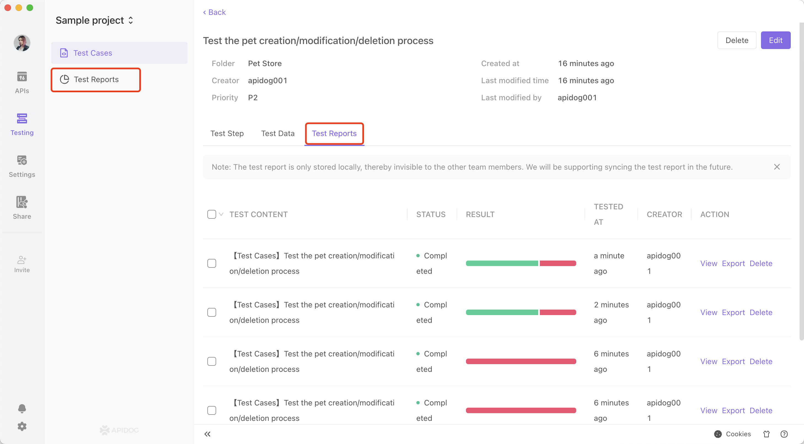

# Test Cases

A test case is running multiple APIs in an order to test the business logic. 


## Create a New Test Case

Path: Automated Testing - Test Cases

Click New Test Case to create a new test case as needed.





## Importing API use cases

Select a test case and go to the edit page.



Move the mouse over the add step on the edit page of the test case.  You will see the menu then. 



There are two ways to add a use case: import from an API and import from an API use case (recommended). 


* Import from API: This will automatically generate a use case according to the API parameters. The parameter value is empty and needs to be manually filled in.
* Import from API use case: There are two methods import, copying and binding. 
    * When you import by copying the API use case, the parameters will also be copied over. It will be independent of the original API use case so that any modification will not affect the original API use case. 
    * When you import by binding the API use case, it will directly reference the original API use case. Changes on both sides will be synchronized with each other in real time. 

Please be aware that: 


* You need to set the API parameters manually after importing an API. Otherwise, the API parameters will be empty.
* After importing from the API use case, the parameters in the API use case will be imported as well. Therefore, no additional manual operation is needed. 

Below is an example of importing from an API use case. 





Below is an example of importing from an API. 




Remember to click on save after importing successfully. 


## Running Test Cases

Click Run to start the automated test.




## Test Reports

As shown in the screenshot below, you can check which API did not pass the test by clicking on the corresponding API to expand the details. For more information, you can directly view the results of the API to locate any problem. 





You can view the test reports from the following two entries. You can also export them.





## Test Data

Click here to view the 
[Test Data Usage Documentation](https://help.apidog.com/test-manage/test-data/).

## FAQ


### If the request parameters of API B depend on API A, how do you implement it?

You want to use postprocessor scripts and variables (local variables, environmental variables, or global variables). 

1. Write a postprocessor script in API A and then write the return value in a variable. For example: 

```js
// Get return response in JSON format.
var jsonData = pm.response.json();

// Write the value of jsonData.token into a variable.
pm.variables.set("token", jsonData.token);
```


2. Set the parameter value of API B as {{token}} to use the value of the token variable.
