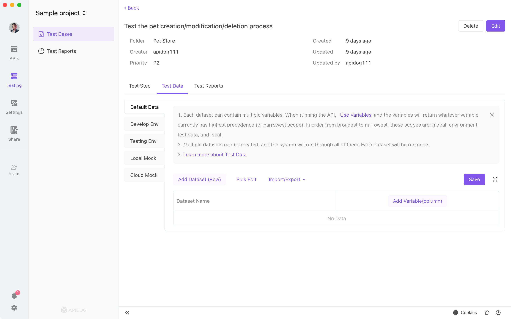
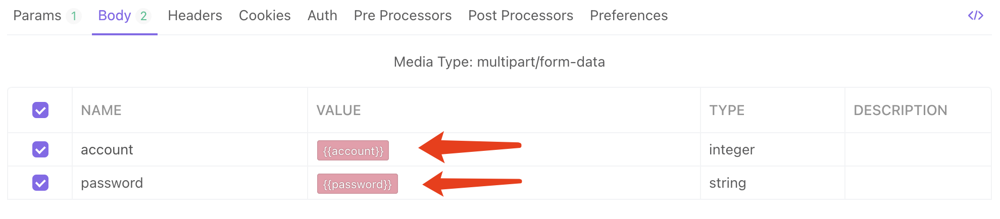
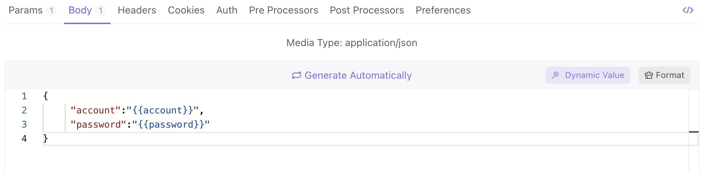
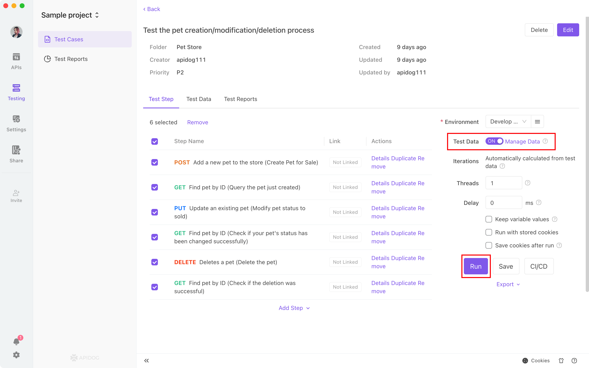

# Test Data

`Test cases` support test data sets. When a test case and test collection runs, the system will run all the data sets in the data file and assign the data to the corresponding variables. 

1. Each data set can contain multiple variables. When the API runs, it will extract the corresponding value for the variable. The variable priority is as follows: local variables > test data variables > environment variables > global variables.
2. You can set up multiple data sets. The system will iterate over all the data sets. 
3. When you sync the data set to the cloud, you can share the data sets with your team members. 
4. You can set different data sets for different environments.

#### Edit Test Data

Open the details page of the test case and go to the test data tab. You can edit the test data by adding data sets, adding variables etc,. You can also `import` data from local `.csv` files.

#### Use Test Data

After importing APIs or API use cases, you can get test data by referencing the corresponding variables

#### Run on Test Data

Turn on the test data and hit run.

