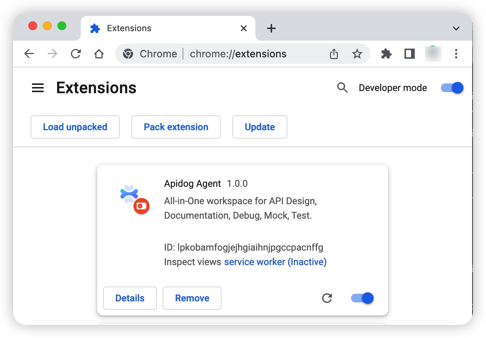

# Browser Extensions

Chrome is needed for API testing using Apidog browser extension. We only support local installs for the time being.

:::tip Download it here.
[Download](https://assets.apidog.com/download/Apidog-browser-extension.zip)

:::

:::tip Limitations.

- Some HTTP Header names like `Cookie`, `Host`, `Origin`, `Content-Length` are reserved header names and will not take effect when the request is actually sent. A complete list can be found on the MDN Web documentation [Forbidden header name](https://developer.mozilla.org/en-US/docs/Glossary/Forbidden_header_name). Modifying such headers is forbidden because the user agent retains full control over them.

:::

## How to install

1. Unzip the zip file.
2. Go to chrome://extensions.

> Please turn on developer mode.

3. You need to refresh the Apidog Web page for the agent to take effect after loading.

## FAQ

1. Why is installation unsuccessful?

Check to make sure the developer mode is turned on in chrome://extensions. Please feel free to contact us for any inquiries.

2. Why does the web version not support calling databases and running code locally?

This is currently not supported in the web version. Please use a [desktop version](https://apidog.com) instead.

3. Why does the web version not support including body in get and head request?

This is currently not supported in the web version. Please use a [desktop version](https://apidog.com) instead.
